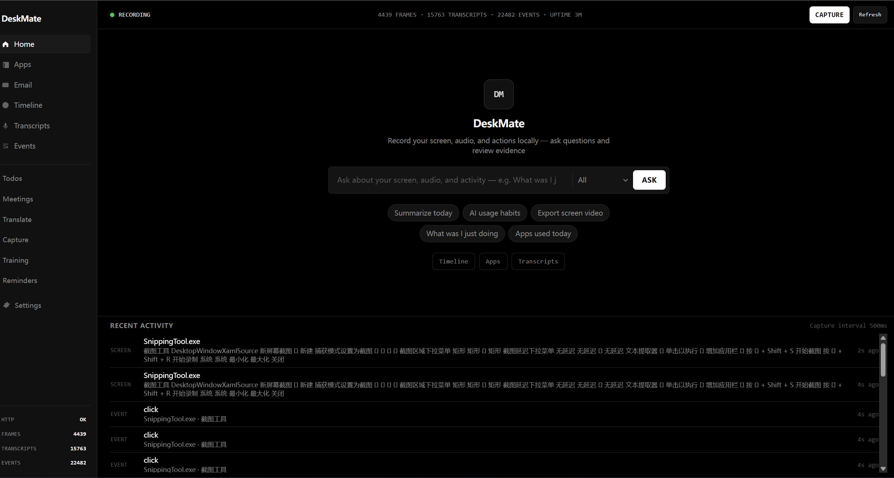

# DeskMate

<div style="text-align:center;">
  
</div>

DeskMate — local-first desktop activity recorder for **Windows**. Captures screenshots, accessibility text, UI events, clipboard activity, and optional audio transcription into a local SQLite database — then exposes everything through a REST API, browser UI, and MCP server.

All data stays on your machine.


## Features

- Event-driven screen capture with adaptive FPS
- UI Automation text + OCR indexing (WinRT or Tesseract)
- Keyboard, mouse, clipboard, and window-focus events
- Optional local audio transcription (Whisper + VAD)
- **Video-call detection** (Teams, Zoom, Meet, Webex, …) with per-meeting transcripts
- Full-text search and natural-language **Ask** (Ollama + 6 tool calls: search, activity, meetings, email)
- **Gmail / Outlook OAuth** for real mailbox search in Ask and apps (not OCR-only)
- Built-in browser UI — no Node build step
- MCP server for agent integrations
- Local LLM apps (day recap, standup, time breakdown, meeting summary, **todo-list**, email digest, …)

## Requirements

- Windows 10/11
- Python 3.10+
- Optional: [Tesseract](https://github.com/tesseract-ocr/tesseract) for OCR, microphone or WASAPI loopback for audio, [Ollama](http://127.0.0.1:11434) for Ask and apps

## Install

```powershell
git clone <repo-url>
cd deskmate
python -m venv .venv
.\.venv\Scripts\Activate.ps1
pip install -e ".[ocr-winrt,audio,mcp]"
```

Common extras: `[ocr-tesseract]`, `[vad]`, `[speaker]`, `[redact-onnx]`, `[full,mcp]`

**OpenVINO GenAI Whisper backend** (NPU / GPU / CPU acceleration):
```powershell
pip install -e ".[audio-openvino]"
```
Then set `whisper_backend = "openvino_genai"` (default device NPU). See [docs/04-audio.md](docs/04-audio.md#whisper-backends) for configuration, device benchmarks, and fallback behavior.

## Quick Start

```powershell
deskmate ui
```

Opens the browser UI at **http://127.0.0.1:3030/ui** and starts recording.

On first run, config and data are created under `%USERPROFILE%\.deskmate\`.

## Usage

### Browser UI

```powershell
deskmate ui                  # record + API + open /ui
deskmate ui --no-run-daemon  # view existing data only
```

| Page | What it does |
|------|--------------|
| Home | Health status, recent activity, **Ask** (natural-language queries) |
| Timeline | Browse frames and screenshots |
| Events | Keyboard, mouse, clipboard, focus events |
| Transcripts | Audio transcriptions |
| Todos | Structured action items from email + meetings — check off, delete, or regenerate |
| Meetings | Detected video calls, transcripts, and one-click summary |
| My Apps | Run LLM apps (todo-list, email-digest, meeting-summary, …); connect Gmail/Outlook in Settings |
| Settings | Config and monitors |

### CLI

```powershell
deskmate serve          # HTTP API (starts recorder by default)
deskmate record         # recorder only
deskmate capture-once   # one manual capture
deskmate search "query" # keyword search via API
deskmate mcp            # MCP stdio server (API must be running)
```

Split API and recorder into two processes:

```powershell
deskmate record
deskmate serve --no-run-daemon
```

### Ask

Home search bar sends questions to `POST /ask`. Ollama runs an agent loop (up to 8 rounds) with these tools:

| Tool | Use for |
|------|---------|
| `search` | Keyword search over OCR, UI events, audio transcripts |
| `activity_summary` | “What was I doing?” — apps, windows, timeline, snippets (not video meetings) |
| `list_meetings` | Video calls detected in the recording window (Teams / Zoom / Meet / …) |
| `meeting_transcript` | Full transcript + action items for one meeting id |
| `email_search` | Connected Gmail / Outlook messages (empty query = latest mail) |
| `email_read` | Full body of one message by id |

Meeting questions (e.g. “今天开了什么会”) should use `list_meetings` first — not browser tab titles from `activity_summary`. Email questions need Gmail or Outlook connected (see above). Requires Ollama running locally.

### LLM Apps

Apps live in `apps/` and run from the **My Apps** page or CLI. See [apps/README.md](apps/README.md) for every app and example commands.

Highlights:

| App | Purpose |
|-----|---------|
| `todo-list` | Unified checkbox todos from **email + meetings** (OAuth + OCR) |
| `meeting-summary` | Summarize the meeting that just ended; patch note on disk |
| `email-digest` | Inbox overview (OAuth + mail-client screen time) |
| `email-compose` | Draft / reply via Gmail or Outlook (`--send` optional) |
| `standup-update` | Yesterday / Today / Blockers (~150 words) |
| `day-recap` / `time-breakdown` / `ai-habits` | Day recap, time split, AI tool usage |

Requires Ollama + the DeskMate API. Apps use the same HTTP API as Ask but run their own Ollama orchestration (prefetch + single-shot or tool loops per `pipe.md`).

## Configuration

Config file: `%USERPROFILE%\.deskmate\config.toml`

Key sections: `[capture]`, `[a11y]`, `[ocr]`, `[audio]`, `[redact]`, `[filters]`, `[server]`

Override via environment variables (`DESKMATE_` prefix):

```powershell
$env:DESKMATE_SERVER__PORT = "4040"
$env:DESKMATE_AUDIO__ENABLED = "true"
```

## Data

```
%USERPROFILE%\.deskmate\
├── config.toml
├── data.db          # SQLite + FTS5
├── frames\          # JPEG snapshots
├── audio\           # WAV chunks (when enabled)
├── videos\          # video chunks
├── logs\
└── pipes\           # optional scheduled pipes
```

To reset: stop deskmate, then delete `data.db` and the folders above.

## API

Default base URL: **http://127.0.0.1:3030**

```
GET  /health
GET  /search?q=...
GET  /frames?limit=20
GET  /frames/{id}/image
POST /capture
POST /ask

GET  /meetings
GET  /meetings/{id}
GET  /meetings/{id}/transcript
POST /meetings/start
POST /meetings/stop

GET    /todos
POST   /todos
PATCH  /todos/{id}
DELETE /todos/{id}

GET  /connections/gmail/messages
GET  /connections/outlook/messages
```

Full endpoint list is in the running server's OpenAPI docs at `/docs` (or `GET /api`).

## License

MIT
