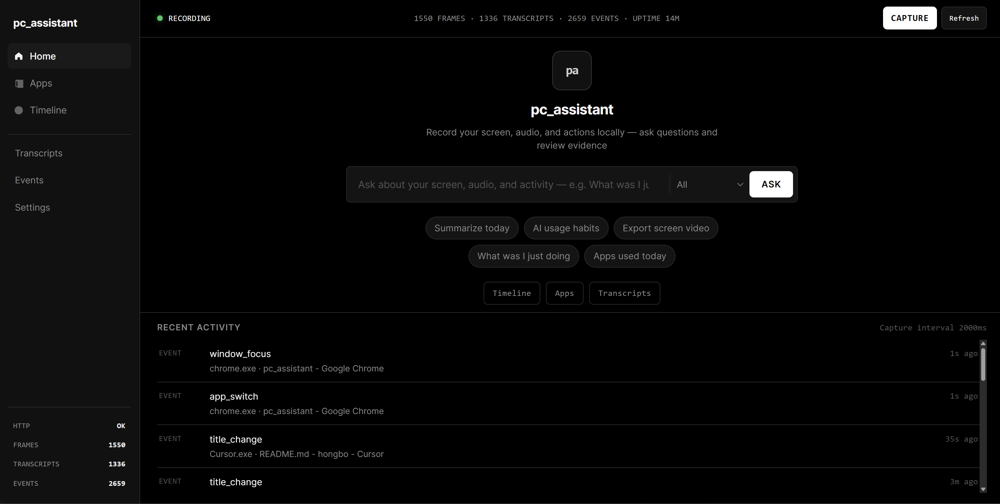

# pc_assistant

<div style="text-align:center;">
  
</div>

Local-first PC activity recorder for **Windows**. Captures screenshots, accessibility text, UI events, clipboard activity, and optional audio transcription into a local SQLite database — then exposes everything through a REST API, browser UI, and MCP server.

All data stays on your machine.

## Outlook OAuth / Microsoft Graph

pc_assistant can connect directly to Outlook through Microsoft Graph, so email apps are not limited to OCR. Register a Microsoft Entra public client, add the redirect URI `http://127.0.0.1:3030/connections/outlook/oauth/callback`, then set `PCA_OUTLOOK__CLIENT_ID` or `[outlook] client_id` in `~/.pc_assistant/config.toml`.

After starting `pc-assistant serve`, open `/connections/outlook/connect` to authorize. The API then exposes `/connections/outlook/instances`, `/connections/outlook/messages`, `/connections/outlook/messages/{id}`, and `/connections/outlook/send`.

## Gmail OAuth / Gmail API

pc_assistant can also connect directly to Gmail. Register a Google OAuth client, add the redirect URI `http://127.0.0.1:3030/connections/gmail/oauth/callback`, then set `PCA_GMAIL__CLIENT_ID` or `[gmail] client_id` in `~/.pc_assistant/config.toml`. If your Google client requires a secret, set `PCA_GMAIL__CLIENT_SECRET` locally rather than committing it.

After starting `pc-assistant serve`, open `/connections/gmail/connect` to authorize. The API exposes `/connections/gmail/instances`, `/connections/gmail/messages`, `/connections/gmail/messages/{id}`, and `/connections/gmail/send`.

## Features

- Event-driven screen capture with adaptive FPS
- UI Automation text + OCR indexing (WinRT or Tesseract)
- Keyboard, mouse, clipboard, and window-focus events
- Optional local audio transcription (Whisper + VAD)
- Full-text search and natural-language **Ask** (Ollama + tool calling)
- Built-in browser UI — no Node build step
- MCP server for agent integrations
- Local LLM apps (day recap, habits, meeting summary, video export)

## Requirements

- Windows 10/11
- Python 3.10+
- Optional: [Tesseract](https://github.com/tesseract-ocr/tesseract) for OCR, microphone or WASAPI loopback for audio, [Ollama](http://127.0.0.1:11434) for Ask and apps

## Install

```powershell
git clone <repo-url>
cd pc_assistant
python -m venv .venv
.\.venv\Scripts\Activate.ps1
pip install -e ".[ocr-winrt,audio,mcp]"
```

Common extras: `[ocr-tesseract]`, `[vad]`, `[speaker]`, `[redact-onnx]`, `[full,mcp]`

## Quick Start

```powershell
pc-assistant ui
```

Opens the browser UI at **http://127.0.0.1:3030/ui** and starts recording.

On first run, config and data are created under `%USERPROFILE%\.pc_assistant\`.

## Usage

### Browser UI

```powershell
pc-assistant ui                  # record + API + open /ui
pc-assistant ui --no-run-daemon  # view existing data only
```

| Page | What it does |
|------|--------------|
| Home | Health status, recent activity, **Ask** (natural-language queries) |
| Timeline | Browse frames and screenshots |
| Events | Keyboard, mouse, clipboard, focus events |
| Transcripts | Audio transcriptions |
| My Apps | Run local LLM analysis apps |
| Settings | Config and monitors |

### CLI

```powershell
pc-assistant serve          # HTTP API (starts recorder by default)
pc-assistant record         # recorder only
pc-assistant capture-once   # one manual capture
pc-assistant search "query" # keyword search via API
pc-assistant mcp            # MCP stdio server (API must be running)
```

Split API and recorder into two processes:

```powershell
pc-assistant record
pc-assistant serve --no-run-daemon
```

### Ask

Home search bar sends questions to `POST /ask`. The agent calls `activity_summary` and `search` against your local data, then summarizes the answer. Requires Ollama running locally.

### LLM Apps

Apps live in `apps/` and run from the **My Apps** page or CLI. See [apps/README.md](apps/README.md) for details. Requires Ollama + the pc_assistant API.

## Configuration

Config file: `%USERPROFILE%\.pc_assistant\config.toml`

Key sections: `[capture]`, `[a11y]`, `[ocr]`, `[audio]`, `[redact]`, `[filters]`, `[server]`

Override via environment variables (`PCA_` prefix):

```powershell
$env:PCA_SERVER__PORT = "4040"
$env:PCA_AUDIO__ENABLED = "true"
```

## Data

```
%USERPROFILE%\.pc_assistant\
├── config.toml
├── data.db          # SQLite + FTS5
├── frames\          # JPEG snapshots
├── audio\           # WAV chunks (when enabled)
├── videos\          # video chunks
├── logs\
└── pipes\           # optional scheduled pipes
```

To reset: stop pc_assistant, then delete `data.db` and the folders above.

## API

Default base URL: **http://127.0.0.1:3030**

```
GET  /health
GET  /search?q=...
GET  /frames?limit=20
GET  /frames/{id}/image
POST /capture
POST /ask
```

Full endpoint list is in the running server's OpenAPI docs at `/docs`.

## License

MIT
