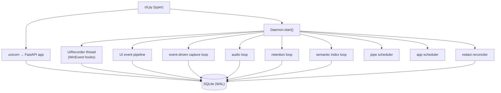

# 01 — Architecture & Runtime

## Purpose

Describe how DeskMate is assembled at runtime: the process/thread model, the
`daemon` that orchestrates background work, and the cross-cutting foundation
modules (`config`, `paths`, `logger`, `events`).

## Key files

| File | Role |
|------|------|
| `deskmate/engine/daemon.py` | Long-running orchestrator that owns and supervises all background threads |
| `deskmate/engine/cli.py` | Typer CLI: `record`, `serve`, `ui`, `search`, `index`, `mcp`, `health` |
| `deskmate/engine/api.py` | FastAPI app factory — the single HTTP integration surface |
| `deskmate/config.py` | Pydantic settings loaded from `config.toml` + `DESKMATE_*` env vars |
| `deskmate/paths.py` | Canonical filesystem layout under `~/.deskmate` (`DESKMATE_HOME` override) |
| `deskmate/logger.py` | Per-module logger; stderr + rotating file handler |
| `deskmate/events.py` | In-process thread-safe event bus (history buffer + subscribe/emit) |

## Runtime topology

DeskMate runs as a single process with many cooperating threads. There are three
entry modes (from the CLI):

- `record` — capture daemon only (no HTTP).
- `serve` — daemon + HTTP API.
- `ui` — daemon + HTTP API + opens the browser at `/ui`.

### Daemon orchestration

`Daemon.__init__` wires up every subsystem from `Config`, then `start()` launches
them and spawns a set of daemon threads (each owns a simple `while not stop` loop):

- **audio loop** — drains recorded audio chunks → transcriber → DB.
- **retention loop** — hourly sweep evicting frames/audio past their retention window.
- **semantic index loop** — periodically embeds newly captured text (only when
  semantic search is enabled).
- **event-driven capture** vs **heartbeat** — chosen by `capture.event_driven`.

`stop()` signals the shared `threading.Event`, joins threads with a timeout, and
closes the DB. This makes shutdown deterministic.

## Foundation modules

- **config.py** — A `Config` pydantic model composed of sub-configs
  (`CaptureConfig`, `A11yConfig`, `OcrConfig`, `AudioConfig`, `RedactConfig`,
  `FilterConfig`, `OllamaConfig`, `ServerConfig`, `SearchConfig`, …). Values come
  from `~/.deskmate/config.toml` and are overridable via `DESKMATE_*` env vars
  (nested via `__`, e.g. `DESKMATE_SEARCH__SEMANTIC_ENABLED=true`).
- **paths.py** — Single source of truth for on-disk locations (db, frames, pipes,
  logs, config). No module hardcodes paths.
- **logger.py** — `get(name)` returns a configured logger; first call sets up
  stderr + a rotating file handler (5 MB × 3 backups).
- **events.py** — A lightweight in-process pub/sub bus with an `EventType` enum and
  a bounded history buffer, used to broadcast lifecycle events to subscribers
  (e.g. HTTP streams).

## Design trade-offs

1. **Single process, many threads** — Simpler than multi-process; all shared state
   funnels through the RLock-guarded DB, so concurrency reasoning stays local.
2. **Config is declarative + env-overridable** — Easy to script and test without
   editing files.
3. **HTTP API as the integration seam** — `ask`, `apps`, `mcp`, and `ui` all go
   through HTTP rather than importing internals, which keeps them decoupled and
   lets the LLM agent run as a separate concern.
4. **Graceful degradation everywhere** — Optional features (audio, OCR engines,
   ONNX redaction, semantic search) are off-by-default or fall back cleanly when
   their dependencies are missing.
