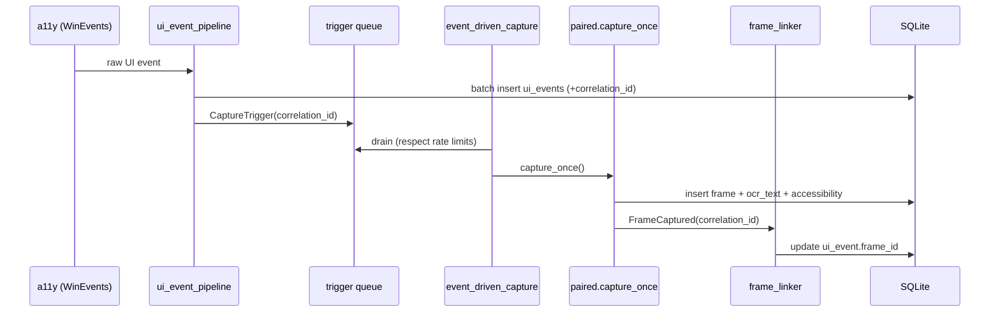

# 02 — Capture

## Purpose

Coordinate screenshot + accessibility capture so that, for a given moment, the
screen image, the OCR text, and the UI Automation tree are all captured together
and linked back to the UI events that triggered them.

Covers `deskmate/capture/` (coordination) and `deskmate/screen/` (screenshot, OCR,
snapshot storage, image redaction).

## Key files

### `capture/`
| File | Role |
|------|------|
| `paired.py` | Core coordinator: snapshot window → filter → screenshot → walk UIA tree → OCR → redact → write DB |
| `event_driven_capture.py` | Rate-limiting + idle-capture state machine that drains the trigger queue |
| `ui_event_pipeline.py` | Batch DB writer for UI events; assigns correlation IDs and routes capture triggers |
| `frame_linker.py` | Background actor + state machine matching `ui_events` rows to frames via correlation ID |

### `screen/`
| File | Role |
|------|------|
| `capture.py` | Multi-monitor enumeration + screenshot via `mss`, with JPEG resize |
| `ocr.py` | Pluggable OCR (RapidOCR/PP-OCR / Windows.Media.Ocr / Tesseract / off) → text + per-word boxes + confidence |
| `snapshot.py` | JPEG writer with date-sharded layout (`YYYY-MM-DD/YYYYMMDDTHHMMSS_mN.jpg`) |
| `redact_image.py` | Pixel-level redaction: OCR regions matching PII → solid black rectangles |
| `video_chunks.py` | Path builder for video chunk files |

## Data flow (end-to-end capture)

1. The accessibility layer fires raw Windows events; the **UI event pipeline**
   batches them into `ui_events`, assigns a **correlation ID** when an event should
   trigger a capture, and pushes a trigger message onto a queue.
2. The **event-driven capture loop** drains the queue, applying two rate limits
   (`min_capture_interval_s` for reactive captures, `idle_capture_interval_s` for
   background polling) so bursts of events don't thrash the screen grabber.
3. **Paired capture** performs the invariant sequence on the focused window:
   screenshot per monitor → walk the UIA tree → OCR → PII redaction → write
   `frames`, `ocr_text`, and `frame_accessibility` rows.
4. The **frame linker** actor receives a `FrameCaptured` message and matches it
   against pending events by correlation ID, back-filling `ui_event.frame_id`.

## OCR engine selection

`screen/ocr.py` exposes four engines, selected by `[ocr] engine`:

| Engine | Backend | Notes |
|--------|---------|-------|
| `rapidocr` | PP-OCR mobile (det+rec) via RapidOCR on **OpenVINO CPU** | Best for Chinese + small UI text; ~16 MB models ship with the package |
| `winrt` (default) | Windows.Media.Ocr (native async) | No extra deps on Windows |
| `tesseract` | pytesseract (system binary) | Weak on Chinese screen text |
| `off` | — | Disabled |

Engines degrade gracefully via a fallback chain: `rapidocr → winrt → tesseract`
when a dependency is missing or a model fails to load. Each is lazily imported;
the RapidOCR engine is built once (≈15 s model load) and reused. OCR returns the
full text, a per-word bounding-box JSON (values stored as **strings**, with
boxes normalized 0–1, to preserve field semantics across consumers), and a
confidence score.

Install RapidOCR with `pip install -e ".[ocr-rapidocr]"`. Measured on an Intel
Core Ultra X7 358H: ~166 ms/frame after warm-up, confidence 0.97–0.99 on
Chinese+English UI text (vs. WinRT/Tesseract which struggle with small Chinese
glyphs). It pins to the OpenVINO **CPU** device — PP-OCR's det/rec models are
fully dynamic-shape, which the NPU compiler rejects, and CPU is already fast
enough.

**Resolution:** OCR runs on the *full-resolution* grab, while the on-disk
snapshot is downscaled to `screenshot_max_width` separately. This keeps small /
high-DPI text legible to OCR without bloating stored frames; normalized word
boxes map onto the stored (downscaled) snapshot unchanged.

## Design trade-offs

1. **Correlation-ID loose coupling** — UI events and frames are produced
   independently and linked after the fact, so neither subsystem blocks the other.
2. **Dual-interval rate limiting** — Separates "react to activity" from "idle
   background snapshot" to balance freshness against overhead.
3. **Paired-capture invariant** — Always capturing screenshot + UIA + OCR in the
   same order on the same window state keeps the three views consistent.
4. **Frame-linker TTL + capacity bound** — A 60 s TTL and a capacity cap evict
   half-paired entries so memory stays bounded if triggers outpace frames.
5. **Date-sharded snapshot storage** — Avoids huge single directories; the monitor
   id in the filename enables multi-monitor reconstruction.
6. **Irreversible block redaction** — Solid black rectangles over PII regions are
   deterministic and simple (vs. reversible blur).
