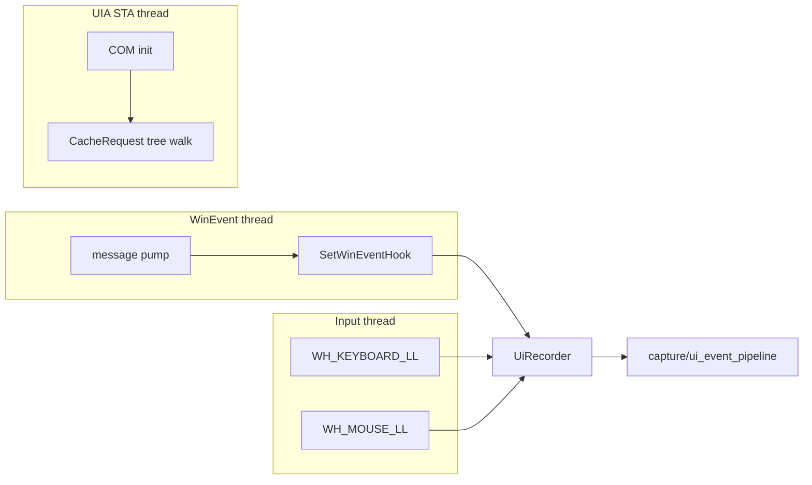

# 03 — Accessibility & Input

## Purpose

Observe what the user is doing via Windows UI Automation (UIA) and low-level
hooks: window focus changes, clicks, sent prompts (Enter), clipboard activity,
and the structured accessibility tree of the focused window.

We do **not** record individual keystrokes. Instead, on Enter / Ctrl+Enter the
input hook takes a single UIA snapshot of the focused input box (the
already-composed text the user is about to send).

Covers `deskmate/a11y/`.

## Key files

| File | Role |
|------|------|
| `win_events.py` | `WinEventWatcher` — owns a Win32 message pump + `SetWinEventHook` for focus/foreground/name-change events |
| `input_hooks.py` | Low-level `WH_KEYBOARD_LL` / `WH_MOUSE_LL` hooks; on Enter/Ctrl+Enter takes a UIA snapshot of the focused input box (no per-character logging), recording its `role` / `value` / `ClassName` / `Name` |
| `clipboard.py` | `ClipboardWatcher` polling `GetClipboardSequenceNumber` to detect copy events |
| `uia_thread.py` | Dedicated COM/STA thread (`UIAutomationInitializerInThread`) for all UIA calls |
| `uia_tree.py` | UIA tree walker with `CacheRequest` batching → structured text + tree JSON |
| `browser_url.py` | Extracts the active browser tab URL from the address-bar UIA element |
| `recorder.py` | `UiRecorder` — assembles watchers + threads into one start/stop unit |
| `activity_feed.py` | Rolls raw events into a higher-level activity stream |
| `ui_event_types.py` | Event dataclasses/enums shared across the a11y layer |

## Threading model

Windows hooks and UIA each require specific thread affinity, so the a11y layer
isolates them:

- **WinEventWatcher** runs its own message pump because `SetWinEventHook`
  callbacks are only delivered to a thread that pumps messages.
- **InputHooks** install global low-level keyboard/mouse hooks. Individual
  characters are never recorded; on **Enter / Ctrl+Enter** (a "send", but not
  Shift+Enter which is a newline) the hook schedules an off-thread UIA read of
  the focused input box and emits one `text` event with `source="send"`. The
  UIA read runs on a short-lived worker thread, never the hook callback, because
  UIA calls can block. `read_focused_value()` returns a
  `(role, value, class_name, name)` tuple; the latter two are stored on the
  event (`focused_class`, `focused_name`) so downstream consumers can tell
  apart chat inputs that share a generic `EditControl` role — e.g. Cursor's
  `aislash-editor-input` class, or VS Code Copilot's `"Chat Input"` Name on the
  shared Monaco `native-edit-context` editor (see
  [13 — Apps](13-apps.md#ai-prompt-journal-prompt-acquisition)).
- **UIA thread** initializes COM in single-threaded apartment (STA) mode and is the
  *only* thread allowed to touch UIA objects, avoiding cross-apartment marshalling
  errors.

## UIA tree extraction

`uia_tree.py` walks the focused window's element tree to produce both flattened
text and a structured JSON tree. It uses a **`CacheRequest`** to batch the
properties it needs (name, control type, value, bounding rect) into a single
cross-process round-trip per element, which is dramatically faster (~10×) than
fetching properties one at a time over COM.

`browser_url.py` is a specialized walk that finds the address-bar element of known
browsers and reads its value — giving each frame a `browser_url`, which downstream
search, meeting detection, and incognito filtering rely on.

## Output

All watchers feed the `UiRecorder`, which normalizes them into UI event objects
and hands them to `capture/ui_event_pipeline.py` for batched persistence and
capture triggering (see [02 — Capture](02-capture.md)).

## Design trade-offs

1. **One thread per affinity constraint** — Message pump, hooks, and UIA each get a
   thread that satisfies their OS requirements, instead of fighting threading rules.
2. **CacheRequest batching** — Trades a slightly larger single request for far
   fewer COM round-trips; the main lever for acceptable capture latency.
3. **Send-time input-box snapshots** — Privacy- and noise-friendly: rather than
   logging every keystroke, captures the composed prompt once at send (Enter),
   reading the full value (including IME / pasted / voice input) via UIA.
4. **Polling the clipboard sequence number** — Cheap and reliable; avoids fragile
   clipboard-viewer chain APIs.
5. **Graceful absence** — If `comtypes`/UIA is unavailable, the recorder still runs
   window-focus + input capture and simply omits tree data.
