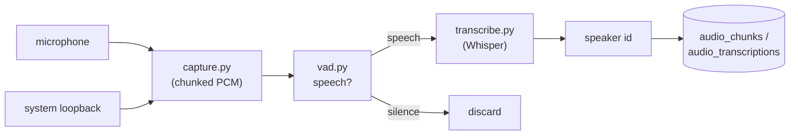

# 04 — Audio

## Purpose

Continuously record system + microphone audio, decide which segments contain
speech, transcribe them with Whisper, and attribute speech to speakers.

Covers `deskmate/audio/`.

## Key files

| File | Role |
|------|------|
| `capture.py` | Records mic + system loopback into fixed-length audio chunks |
| `speaker.py` | Loopback/device selection + speaker-embedding model loading |
| `vad.py` | Voice Activity Detection — gates silence out before transcription |
| `transcribe.py` | Whisper wrapper: language handling, hallucination filtering, transcribe kwargs |
| `pipeline_status.py` | Tracks the live state of the audio pipeline for the API/UI |

## Pipeline

1. **Capture** grabs both the microphone and the system output (loopback) and
   writes fixed-duration PCM chunks. Loopback lets DeskMate transcribe the *other*
   side of calls, not just the local mic.
2. **VAD** classifies each chunk (or sub-window) as speech or silence. Silent
   chunks are dropped so Whisper never runs on empty audio — the single biggest
   cost/noise saver.
3. **Transcription** runs Whisper on speech segments. `transcribe.py` handles:
   - language detection vs. a forced language (and an optional translate mode);
   - an energy gate (`MIN_RMS_ENERGY`) so near-silent audio is skipped;
   - **hallucination filtering** — Whisper tends to emit canned phrases on
     low-information audio, which are filtered by confidence/repetition thresholds.
4. **Speaker identification** uses an embedding model to assign a `speaker_id`,
   enabling "who said what" in search and summaries.

The **audio loop** in `engine/daemon.py` drives this pipeline and writes results
to `audio_chunks` and `audio_transcriptions`, which are also FTS5-indexed.

## Design trade-offs

1. **VAD before Whisper** — Transcription is the expensive step; gating on speech
   first cuts compute drastically and avoids garbage transcripts.
2. **Energy gate + hallucination filter** — Whisper "hears" words in noise;
   layered thresholds keep the transcript trustworthy.
3. **Loopback + mic** — Capturing both sides makes call/meeting transcripts useful
   instead of one-sided.
4. **Optional & degradable** — Audio is feature-flagged; if no audio backend or
   model is present the rest of DeskMate runs unaffected.
5. **Chunked recording** — Fixed-length chunks bound memory and make the
   capture → VAD → transcribe stages cleanly pipelineable.
