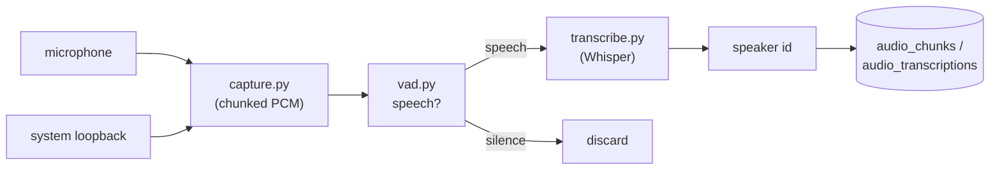

# 04 — Audio

## Purpose

Continuously record system + microphone audio, decide which segments contain
speech, transcribe them with Whisper, and attribute speech to speakers.

Covers `deskmate/audio/`.

## Key files

| File | Role |
|------|------|
| `capture.py` | Records mic + system loopback into fixed-length audio chunks |
| `speaker.py` | Loopback/device selection + speaker-embedding model loading |
| `vad.py` | Voice Activity Detection — gates silence out before transcription |
| `transcribe.py` | Whisper orchestrator: VAD segmentation, language handling, hallucination filtering |
| `transcribe_backends.py` | Pluggable Whisper engines (`onnx_cpu` / `openvino_genai`) behind one interface |
| `pipeline_status.py` | Tracks the live state of the audio pipeline for the API/UI |

## Pipeline



1. **Capture** grabs both the microphone and the system output (loopback) and
   writes fixed-duration PCM chunks. Loopback lets DeskMate transcribe the *other*
   side of calls, not just the local mic.
2. **VAD** classifies each chunk (or sub-window) as speech or silence. Silent
   chunks are dropped so Whisper never runs on empty audio — the single biggest
   cost/noise saver.
3. **Transcription** runs Whisper on speech segments. `transcribe.py` handles:
   - language detection vs. a forced language (and an optional translate mode);
   - an energy gate (`MIN_RMS_ENERGY`) so near-silent audio is skipped;
   - **hallucination filtering** — Whisper tends to emit canned phrases on
     low-information audio, which are filtered by confidence/repetition thresholds.
4. **Speaker identification** uses an embedding model to assign a `speaker_id`,
   enabling "who said what" in search and summaries.

The **audio loop** in `engine/daemon.py` drives this pipeline and writes results
to `audio_chunks` and `audio_transcriptions`, which are also FTS5-indexed.

## Design trade-offs

1. **VAD before Whisper** — Transcription is the expensive step; gating on speech
   first cuts compute drastically and avoids garbage transcripts.
2. **Energy gate + hallucination filter** — Whisper "hears" words in noise;
   layered thresholds keep the transcript trustworthy.
3. **Loopback + mic** — Capturing both sides makes call/meeting transcripts useful
   instead of one-sided.
4. **Optional & degradable** — Audio is feature-flagged; if no audio backend or
   model is present the rest of DeskMate runs unaffected.
5. **Chunked recording** — Fixed-length chunks bound memory and make the
   capture → VAD → transcribe stages cleanly pipelineable.

## Whisper backends

Whisper transcription runs behind one of two interchangeable backends, chosen by
`[audio] whisper_backend` in `~/.deskmate/config.toml`:

| Backend | Engine | Devices | Models |
|---------|--------|---------|--------|
| `onnx_cpu` (default) | faster-whisper (CTranslate2 + ONNX Runtime) | CPU | `whisper_model` size tier |
| `openvino_genai` | OpenVINO GenAI `WhisperPipeline` | **NPU** / GPU / CPU | `openvino_genai_model` (GenAI IR) |

`transcribe.py` is a backend-agnostic orchestrator (RMS gating, VAD
segmentation, clip writing, language resolution); `transcribe_backends.py` holds
the engines behind a `TranscriptionBackend` ABC plus a registry. Adding an
engine is one subclass + one registry entry — the orchestrator never changes.
(VAD and the PII redactor are independent of this choice — VAD always uses
silero-vad, the redactor always uses ONNX Runtime.)

```toml
[audio]
enabled = true
whisper_backend = "openvino_genai"  # onnx_cpu | openvino_genai
whisper_model = "small"             # onnx_cpu size tier (tiny|base|small|medium)
# openvino_genai settings:
openvino_genai_model = "OpenVINO/whisper-medium-int8-ov"  # ModelScope id or local IR dir
openvino_device = "NPU"             # NPU | GPU | CPU | AUTO
```

Install with `pip install -e ".[audio-openvino]"` (pulls `openvino-genai` +
`modelscope`). On first use the model is auto-downloaded from ModelScope (or
loaded from a local GenAI-IR directory) and cached under
`~/.cache/modelscope/`.

### OpenVINO GenAI device notes

Validated on an Intel Core Ultra X7 358H (AI Boost NPU + Arc iGPU) — all three
devices transcribe correctly:

| Device | First load | Warm load | Inference / clip |
|--------|-----------|-----------|------------------|
| **NPU** (default) | ~195 s (compile) | ~3 s (cached) | ~0.7 s |
| GPU | ~17 s | ~17 s | ~0.7 s |
| CPU | ~2 s | ~2 s | ~2 s |

NPU/GPU inference is ~3× faster than CPU. The NPU's first compile is slow, so
the backend passes a `CACHE_DIR` (`~/.deskmate/ov_cache`) — OpenVINO persists the
compiled blob and later starts load in seconds. If the chosen device can't load
(missing NPU driver, etc.) the backend falls back to CPU.

> The earlier third-party `whisper-openvino` fork was dropped: its IR had a
> dynamic-shape decoder the NPU couldn't compile. OpenVINO GenAI handles the
> static-shape conversion internally, which is why NPU now works.

**Fallback.** Choosing `openvino_genai` never hard-fails: if `openvino-genai` /
`modelscope` is missing or the model can't load on any device, Whisper falls
back to the `onnx_cpu` backend (faster-whisper). The backend actually loaded is
logged at startup.
