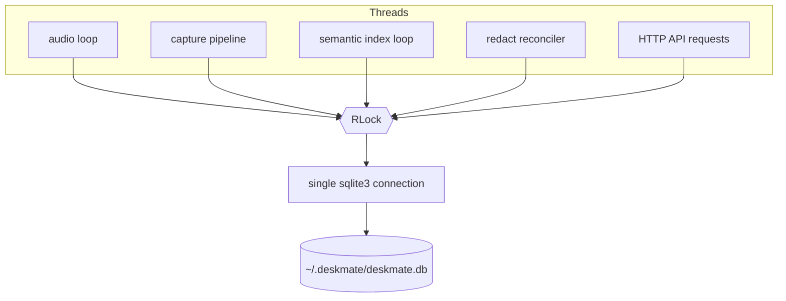
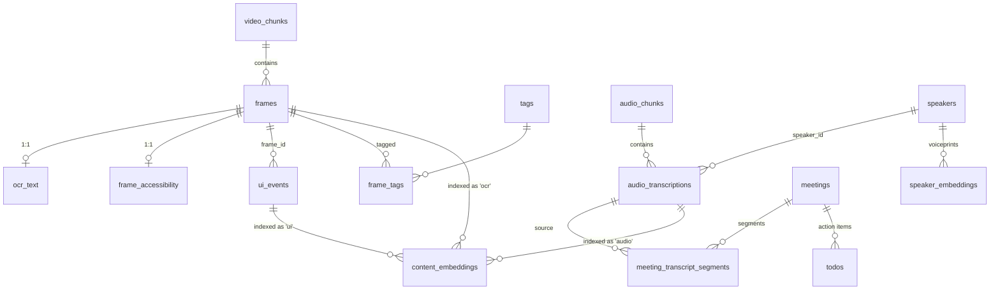

# 05 — Storage

## Purpose

Provide a single, thread-safe, local SQLite database that is the source of truth
for frames, OCR, accessibility, audio, UI events, meetings, todos, memories, and
the indexes (FTS5 + embeddings) used for retrieval.

Covers `deskmate/db/` (search internals are in [06 — Search](06-search.md)).

## Key files

| File | Role |
|------|------|
| `manager.py` | `DatabaseManager` — one `sqlite3` connection + `RLock`, WAL mode, migrations, insert/query helpers |
| `schema.py` | The whole schema as one SQL snapshot + `SCHEMA_VERSION` |
| `text_normalizer.py` | FTS5 query sanitization, camelCase splitting, prefix expansion |
| `search_engine.py` | Keyword / semantic / hybrid retrieval (see doc 06) |
| `search_types.py` | `ContentType` and result-kind enums |
| `embeddings.py` / `semantic_index.py` | Vector embedding + indexing (see doc 06) |

## Connection model



- **One connection guarded by a `threading.RLock`.** All writes serialize through
  the lock; WAL mode lets readers proceed concurrently with a writer.
- **PRAGMAs** (set once in `schema.py`): `journal_mode=WAL`,
  `synchronous=NORMAL`, `foreign_keys=ON`, `temp_store=MEMORY`,
  `busy_timeout=5000`, `cache_size=-64000` (≈64 MB), `mmap_size=256 MB`.
- **Schema as a snapshot, not a migration chain.** `schema.py` holds the *entire*
  current schema; the applied version is recorded in `_pca_migrations`. There is
  no replay of historical migrations — `manager.py` applies the snapshot and lazily
  adds missing columns for older databases.

## Table design

The tables fall into four groups: **screen capture**, **audio**, **derived /
organizational**, and **indexes**.

### Entity relationships



### Screen-capture tables

| Table | What a row is | Key columns |
|-------|---------------|-------------|
| `video_chunks` | One recorded video file | `file_path`, `device_name`, `fps` |
| `frames` | One captured moment (a JPEG snapshot, or an offset into a video chunk) | `video_chunk_id` (NULL ⇒ snapshot), `snapshot_path`, `timestamp`, `app_name`, `window_name`, `browser_url`, `monitor_id`, `capture_trigger` (`heartbeat`/event), `image_redacted` |
| `ocr_text` | The text OCR'd from one frame (1:1 with `frames`) | PK `frame_id`; `text`, `text_json` (per-word boxes), `redacted_text`, `ocr_engine` |
| `frame_accessibility` | The UIA tree text for one frame (1:1) | PK `frame_id`; `text`, `tree_json`, `focused_role/name/value`, `elements_ref_frame_id` (dedup pointer when unchanged), `redacted_text` |
| `ui_events` | One user interaction (click/key/text/scroll/app_switch/focus/clipboard) | `event_type`, `app_name`, `window_title`, `browser_url`, `frame_id` (link to the frame it triggered), `data_json`, `element_json` |

`frames` is the hub: OCR and accessibility hang off it 1:1, `ui_events` link back
to it via `frame_id` (filled in by the frame linker, see [02 — Capture](02-capture.md)),
and `ON DELETE CASCADE` on the child tables means evicting a frame cleans up its
text automatically.

### Audio tables

| Table | What a row is | Key columns |
|-------|---------------|-------------|
| `audio_chunks` | One recorded audio file | `file_path`, `device_name`, `timestamp`, `processing_status` (`pending`/`processed`/`failed`/`evicted`), `duration_ms` |
| `audio_transcriptions` | One transcribed segment | `audio_chunk_id`, `transcription`, `language`, `speaker_id`, `start_time`/`end_time`, `redacted_transcription` |
| `speakers` | A diarized speaker identity | `name`, `centroid_json` (mean voice embedding), `sample_count` |
| `speaker_embeddings` | One voiceprint sample for a speaker | `speaker_id`, `embedding_json`, `audio_chunk_id`, `transcription_id` |

Speaker attribution uses **voice embeddings** stored as JSON: each utterance's
embedding is compared to per-speaker `centroid_json`; the centroid is updated as
more samples arrive (`sample_count`). Deleting a chunk/transcription uses
`ON DELETE SET NULL` so transcripts and speaker history survive eviction.

### Derived / organizational tables

| Table | What a row is | Notes |
|-------|---------------|-------|
| `meetings` | A detected meeting | `name`, `started_at`, `ended_at`, `metadata` |
| `meeting_transcript_segments` | One spoken line within a meeting | links `meeting_id` + `transcription_id` + `speaker_id` |
| `todos` | An extracted action item | `source` (email/meeting/manual), `priority`, `due`, `dedup_key` with a partial UNIQUE index for idempotent upserts |
| `tags` / `frame_tags` | Free-form labels on frames | many-to-many |
| `memories` | Lightweight notes used by automations | `content`, optional `frame_id` |
| `pipe_executions` | One run of a pipe/app | `pipe_name`, `status`, `output`, `started_at`/`ended_at` |

### Index tables

| Table | Kind | Indexes which text |
|-------|------|--------------------|
| `frames_full_text` | FTS5 virtual | app/window/url/document + `ocr_text` + `accessibility_text` per frame |
| `audio_transcriptions_fts` | FTS5 virtual | `transcription` (with `speaker_id` UNINDEXED) |
| `ui_events_fts` | FTS5 virtual | app/window/`text_content` of input events |
| `content_embeddings` | regular table | one vector per indexed piece of text (see doc 06) |

FTS5 tables use `tokenize = 'unicode61 remove_diacritics 2'` (diacritic-folding,
CJK-friendly) and mark id/timestamp columns `UNINDEXED` so they're stored but not
tokenized. They are maintained **inline** as content is written, so keyword search
is current immediately.

`content_embeddings` is the bridge to semantic search and is deliberately a plain
table (no vector extension):

```sql
content_embeddings(
    id, content_type,  -- 'ocr' | 'audio' | 'ui'
    content_id,        -- frame_id | transcription_id | event_id
    model, dim, embedding BLOB,  -- little-endian float32 vector
    timestamp,
    UNIQUE(content_type, content_id, model)
)
```

The `UNIQUE(content_type, content_id, model)` constraint makes indexing idempotent
and lets a model change re-index cleanly. See [06 — Search](06-search.md) for how
the vector flows in and out.

## Text normalization

`text_normalizer.py` prepares user queries for FTS5: it strips/escapes FTS5
operator characters, splits compound identifiers (`getUserName` → `get user
name`) so code-style text is matchable, and can add prefix wildcards.

## Design trade-offs

1. **Single connection + RLock** — Simplicity and correctness over write
   concurrency; right for a single-user desktop workload.
2. **Schema snapshot + lazy column add** — No migration-replay framework; old DBs
   keep working.
3. **`frames` as the hub with CASCADE/SET NULL** — Retention can evict a frame and
   its text together, while transcripts/speakers degrade gracefully.
4. **Vectors in a plain BLOB table** — Portable (no `sqlite-vss`/extension);
   similarity is computed in Python over a bounded candidate set (doc 06).
5. **Inline FTS5 + out-of-band embeddings** — Keyword search is always live;
   the heavier vector index is built in the background.
