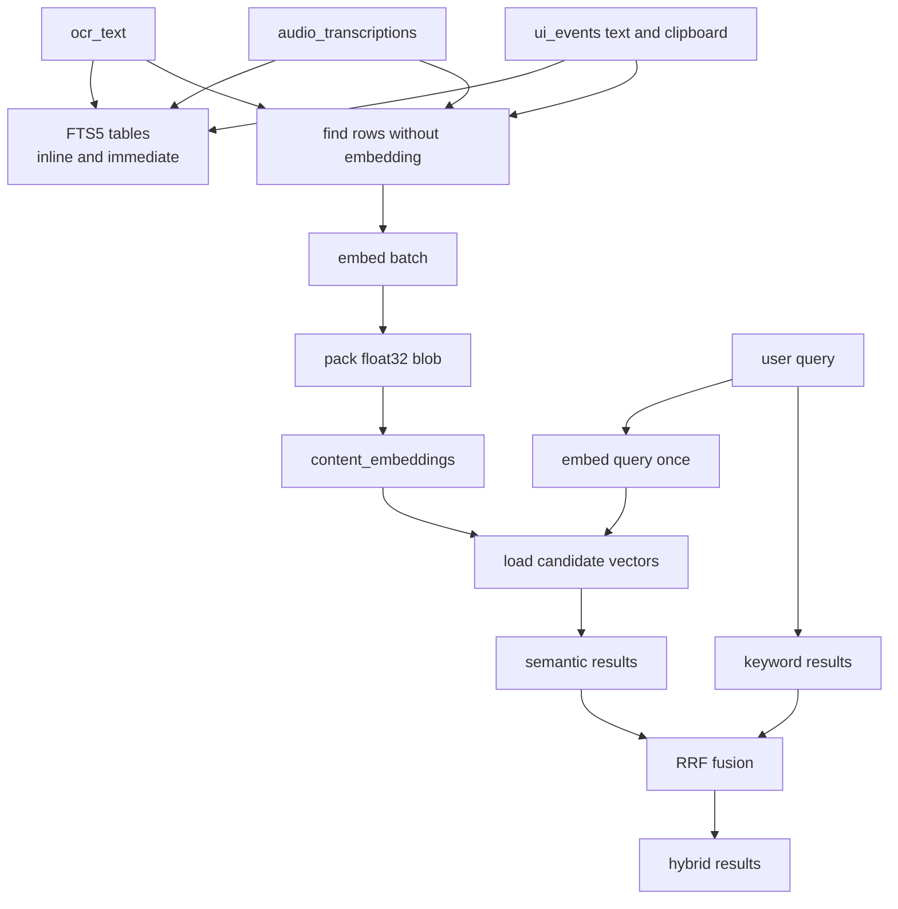
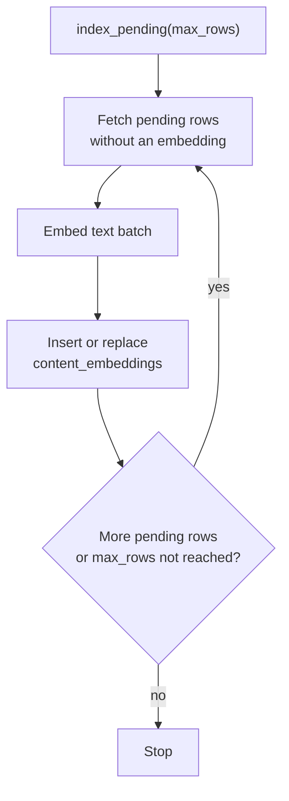
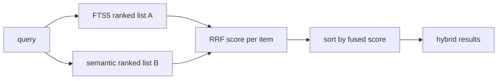

# 06 — Search & Embeddings

## Purpose

   OCR["ocr_text"] --> FTS["FTS5 tables inline and immediate"]
   TR["audio_transcriptions"] --> FTS
   UI["ui_events text and clipboard"] --> FTS

   OCR --> FIND["find rows without embedding"]
   TR --> FIND
   UI --> FIND
   FIND --> EMB["embed batch"]
   EMB --> BLOB["pack float32 blob"]
   BLOB --> CE["content_embeddings"]

   Q["user query"] --> QEMB["embed query once"]
   QEMB --> SCAN["load candidate vectors"]
   CE --> SCAN
   SCAN --> SEMR["semantic results"]
   Q --> KWR["keyword results"]
   SEMR --> RRF["RRF fusion"]
   KWR --> RRF
   RRF --> OUT["hybrid results"]

The key idea: **capture writes raw text + FTS5 inline and never blocks on
embeddings.** A separate background loop turns that text into vectors later, and
queries embed only the query string on demand. So embeddings are an *optional,
additive* layer — if the model can't load, everything above still works as
keyword-only search.

## 1. Producing embeddings — `embeddings.py`

`EmbeddingModel` wraps a small CPU-friendly ONNX model via `fastembed` (no
`torch`, no cloud call):

- **Lazy load** — the model is constructed on first use inside a lock; if
  `fastembed` or the model download is missing it logs a warning and returns
  `None`, disabling the whole semantic path.
- **L2-normalized vectors** — embeddings come out unit-length, so a plain **dot
  product equals cosine similarity** (no per-query renormalization of stored
  vectors needed).
- **BLOB layout** — `vector_to_blob` packs the floats as **little-endian float32**
  (`struct.pack("<…f")`); `blob_to_vector` unpacks them. This is the exact on-disk
  format of `content_embeddings.embedding`.
- **Process-wide singleton** — `get_embedder(model_name)` caches one model keyed by
  name, so a config change rebuilds it but normal use shares one instance.

## 2. Indexing — `semantic_index.py`

`SemanticIndexer` keeps `content_embeddings` in sync with the captured text. It
runs both as a one-time **backfill** and **incrementally** from the daemon's
`_semantic_index_loop`.

For each content type it issues a "pending" query — a `LEFT JOIN content_embeddings
… WHERE ce.id IS NULL` that selects rows which do **not yet** have a vector for the
current model:

| `content_type` | Source rows | Text used |
|----------------|-------------|-----------|
| `ocr` | `frames_full_text` | accessibility text, else OCR text |
| `audio` | `audio_transcriptions` | `transcription` |
| `ui` | `ui_events` of type `text`/`clipboard` | `data_json.content` |

Each batch is filtered by a minimum length (`min_chars`), embedded, and written
with `INSERT OR REPLACE` into `content_embeddings`:

Because the index key is `UNIQUE(content_type, content_id, model)`, re-runs are
**idempotent** and switching `embedding_model` simply re-indexes under the new
model name (old vectors are ignored by queries that filter on `model`).

## 3. Querying — `search_engine.py`

### Keyword search

FTS5 `MATCH` over the per-type virtual tables, ordered by BM25. Queries are run
through `text_normalizer` first so screen-captured/code-like text matches. Always
available, no model needed.

### Semantic search

`semantic_search()`:

1. Embeds the query once (`embed_one`) and normalizes it.
2. Loads a **bounded candidate set** from `content_embeddings` — filtered by
   `content_type`, `model`, and optional time range, `ORDER BY timestamp DESC
   LIMIT candidate_pool` (default 5000).
3. Unpacks the BLOBs into a NumPy matrix and computes similarity in one shot:
   `sims = (mat @ qvec) / norms` — i.e. brute-force cosine over the candidates.
4. Takes the top *N*, fetches the full rows by id (applying app/window/speaker
   filters), and returns `(result, score)` pairs.

If NumPy or the embedder is unavailable, it returns `[]` and the caller falls back
to keyword search.

### Hybrid search (RRF)

`hybrid_search()` runs both legs and fuses them with **Reciprocal Rank Fusion**,
which uses only each item's *rank* (not its raw score):

$$\text{score}(d) = \sum_{r \in \{\text{keyword},\,\text{semantic}\}} \frac{1}{k + \text{rank}_r(d) + 1}$$

with $k = 60$ (`rrf_k`). RRF sidesteps the fact that BM25 scores and cosine
similarities live on incomparable scales — it just rewards items that rank highly
in *either* list. If the semantic leg is empty, it returns the keyword list
unchanged.

## Configuration (`SearchConfig`)

| Field | Default | Meaning |
|-------|---------|---------|
| `semantic_enabled` | `False` | Master switch for semantic/hybrid (and `/search?semantic=true`) |
| `embedding_model` | `BAAI/bge-small-en-v1.5` | fastembed model id |
| `rrf_k` | `60` | RRF constant |
| `candidate_pool` | `5000` | Max embeddings scanned per semantic query |
| `auto_index` | `True` | Run the background indexer in the daemon |
| `index_batch` | `64` | Rows embedded per batch |
| `min_chars` | `12` | Skip indexing very short text |

## Surfaces

- HTTP: `GET /search?...&semantic=true` (gated on `semantic_enabled`).
- CLI: `deskmate search --semantic`, and `deskmate index` to build/backfill vectors.
- `engine/ask.py` defaults its tool calls to `semantic=true`.
- `apps/agent.py` also defaults app-issued search calls to `semantic=true`.

In other words, both the Ask agent and the app runner now **prefer hybrid
retrieval by default**. That does **not** mean every search always runs the
embedding leg: the API still checks `cfg.search.semantic_enabled`, and only then
dispatches to `hybrid_search()`. If semantic search is disabled, the same request
automatically falls back to the normal FTS5/BM25 path.

This split is intentional:

- the **caller** (`ask` or `apps`) expresses a preference for hybrid recall;
- the **API** decides whether the environment can actually satisfy that request;
- the **search engine** either runs keyword + semantic + RRF, or degrades to
   keyword-only without changing the caller contract.

## Design trade-offs

1. **Embeddings off the hot path** — Capture only writes text + FTS5; vectors are
   produced in the background, so recording is never slowed by the model.
2. **Plain BLOB + brute-force cosine over a capped pool** — No vector-index
   extension to install; `candidate_pool` bounds the scan cost while keeping the
   schema portable.
3. **L2-normalized vectors** — Lets cosine reduce to a dot product, simplifying the
   query math.
4. **RRF over score normalization** — Fuses heterogeneous rankers with no scale
   tuning; stable and well understood.
5. **Strictly additive & idempotent** — Off by default, degrades to keyword-only,
   and re-indexing is safe thanks to the `(content_type, content_id, model)` key.
