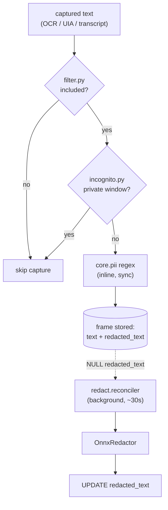

# 07 — Privacy & Redaction

## Purpose

Keep sensitive content out of storage (or remove it after the fact) through a
layered pipeline: content/window filtering, incognito detection, fast regex PII
redaction inline, and an optional ONNX model that reconciles redactions in the
background.

Covers `deskmate/core/` and `deskmate/redact/`.

## Key files

### `core/`
| File | Role |
|------|------|
| `filter.py` | Window/app inclusion-exclusion matching (bare tokens or `"App::Title"` patterns) |
| `incognito.py` | Heuristic private-window detection from window titles (multilingual keywords) |
| `pii.py` | Regex PII detection (email, phone, SSN, credit card, IP, API tokens) → spans + redaction |

### `redact/`
| File | Role |
|------|------|
| `__init__.py` | Public API: `apply_text`, `maybe_redact`; exports `OnnxRedactor`, `RedactReconciler` |
| `onnx.py` | `OnnxRedactor` — token-classification ONNX model (DirectML→CPU) marking PII tokens |
| `reconciler.py` | Background worker re-scanning rows whose `redacted_text` is still NULL |

## Two-layer redaction

1. **Filtering** — `filter.py` decides whether a window/app should be captured at
   all, using inclusion/exclusion patterns that can target the app, the title, or
   a scoped `App::Title` combination.
2. **Incognito** — `incognito.py` inspects the window title for private-browsing
   markers (multilingual, e.g. *incognito*, *private browsing*, *无痕*, *隐私浏览*)
   and suppresses capture for private sessions.
3. **Inline regex PII** — `core/pii.py` runs synchronously before write, returning
   character **spans** so only the matched substrings are masked (not the whole
   text). Callers select which rule sets apply.
4. **ONNX reconciliation** — `redact/reconciler.py` is a background thread that
   periodically pulls a batch of rows whose `redacted_text` is still unset, runs the
   `OnnxRedactor` token classifier, and writes the result back. This catches PII the
   regexes miss without slowing capture.

## ONNX redactor

`onnx.py` lazily loads an ONNX token-classification model, preferring the DirectML
execution provider on Windows and falling back to CPU. It tokenizes text, marks
tokens whose PII probability exceeds a threshold, and returns the redacted string.
If `onnxruntime` or the model file is missing, the redactor reports unavailable and
the system relies on regex only.

## Design trade-offs

1. **Fast path + slow path** — Regex blocks obvious PII instantly at write time;
   the heavier ML model runs out-of-band so it never blocks capture.
2. **Span-based redaction** — Masks only the offending substrings, preserving
   surrounding context for search/summaries.
3. **Idempotent reconciliation** — Only NULL `redacted_text` rows are processed, so
   re-running over a populated DB is safe and resumable.
4. **Graceful degradation** — Both incognito detection and ONNX redaction fail
   safe: missing model ⇒ regex-only; uncertain window ⇒ err toward not capturing.
5. **Multilingual heuristics** — Incognito/PII keywords cover non-English locales so
   privacy isn't English-only.
