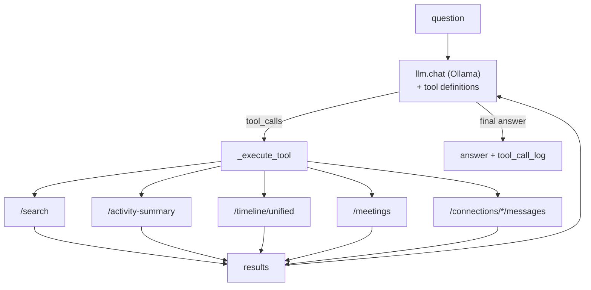

# 08 — Engine & Intelligence

## Purpose

The control plane and LLM layer: a daemon that orchestrates capture, an HTTP API
that exposes the data, an LLM client, and an agentic "Ask" loop plus activity
summaries that turn raw captures into answers.

Covers `deskmate/engine/` (the runtime/orchestration parts; foundation modules are
in [01 — Architecture](01-architecture.md)).

## Key files

| File | Role |
|------|------|
| `daemon.py` | Spawns and supervises all background threads (audio, retention, indexing, capture, pipes, schedulers) |
| `api.py` | FastAPI app: `/search`, `/activity-summary`, `/ask`, `/frames`, `/transcripts`, `/connections/*`, `/health`, `/ui` |
| `cli.py` | Typer CLI entry points (`record`, `serve`, `ui`, `search`, `index`, `mcp`, `health`, `train-lora`) |
| `llm.py` | Stateless Ollama HTTP client with `FriendlyError` wrapping |
| `ask.py` | Agentic question-answering loop calling API tools |
| `activity_summary.py` | Aggregates frames/UI/audio/files into a structured summary |
| `day_recap_context.py` | Text normalization, low-value phrase filtering, dedup helpers |
| `app_scheduler.py` | Parses `pipe.md` schedules and spawns `apps/<name>/app.py` subprocesses |

## The Ask agent loop

`ask.py` answers natural-language questions by letting the LLM call DeskMate's own
HTTP API as tools, rather than querying the DB directly.

- The LLM receives the question plus tool schemas (search, activity_summary,
  timeline, list_meetings, email search/read) and emits `tool_calls`.
- Each tool call is dispatched as an HTTP request to the local API; results are fed
  back so the model can reason over real data.
- The loop is **bounded to ~8 rounds** to prevent runaway tool calling, and it
  **auto-broadens empty time ranges** (e.g. nothing in the last 2 minutes ⇒ retry
  ±1 hour) so vague questions still find data.
- When semantic search is enabled, search tool calls default to `semantic=true`.

### The `timeline` tool

`ask.py` exposes a `timeline` tool (dispatched by `_execute_timeline`) that reads
the unified `/timeline/unified` feed. It is the tool of choice for **strongly
time-ordered, cross-source** questions — "what did I do step by step between X and
Y", "what did I copy/paste", "what did I type during the meeting" — where
`search` (keyword) and `activity_summary` (aggregate stats) fall short. It
normalizes ISO times, validates `sources` against
`{screen,audio,input,clipboard,window}`, clamps `limit` to 1–1000, and slims each
row to `{ts, source, kind, app, window, summary, confidence}` before returning it
to the model. See [15 — Fusion & timeline](15-fusion-timeline.md).

## LLM client

`llm.py` is a **stateless** transport over Ollama's HTTP API: callers pass the base
URL and model on each call, so there's no hidden session state. It wraps failures
in `FriendlyError` subtypes (`FriendlyConnectionError`, `FriendlyTimeoutError`, …)
that translate low-level errors into actionable messages ("Ollama isn't running",
"model not pulled", "timed out"). The same helpers are reused by `apps/agent.py`,
keeping the request shape symmetric. Provisioning and *running* that Ollama
service (download / pull / start-stop) is owned by `modelsvc/` —
see [20 — Model Service](20-model-service.md).

## Activity summary

`activity_summary.py` aggregates a time window into a structured object: apps by
time spent, key OCR/UI texts, a timeline, audio snippets, and edited files.
`day_recap_context.py` cleans the inputs (normalize text, drop low-value/boilerplate
phrases, dedupe, count line frequencies) so summaries and the `day-recap` app stay
signal-rich. This is the broad-context tool the Ask agent and several apps call
before doing targeted searches.

## API surface

`api.py` is the single integration seam consumed by the CLI, the Ask agent, the
`apps/`, the `mcp/` server, and the web `ui/`. It shapes raw DB rows into stable
JSON item types (OCR / audio / UI / input / memory) and serves the static UI.

## Design trade-offs

1. **Agent talks to the API, not the DB** — Decouples reasoning from storage and
   lets the agent run as its own concern; identical to how `apps` work.
2. **Bounded rounds + auto-broadening** — Caps cost while still being forgiving of
   under-specified questions.
3. **Stateless LLM client + FriendlyError** — Easy to test and reuse; turns opaque
   failures into user-fixable guidance.
4. **Summarize-then-search** — Cheap broad context first, expensive precise search
   only when needed.
