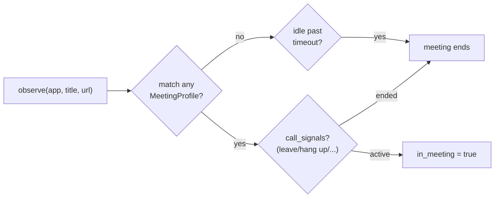

# 09 — Meeting & Workflow

## Purpose

Two lightweight, mostly-local classifiers that add semantic structure on top of raw
captures: detecting when the user is in a video call, and labeling each activity
frame with a workflow category.

Covers `deskmate/meeting/` and `deskmate/workflow/`.

## Meeting detection — `meeting/detector.py`

Detects active video calls by matching the focused window title, app name, and
browser URL against a set of hardcoded **profiles** (Teams, Zoom, Google Meet,
Slack Huddle, Discord, Webex, …).

- **`MeetingProfile`** — a tuple of `(name, app_tokens, url_tokens, title_tokens,
  call_signals)`. A frame is "in a meeting" when its window/app/url contains the
  profile's tokens.
- **`MeetingObservation`** — records `in_meeting`, the matched signals, and the
  profile name for each observation.
- **Lifecycle** — `call_signals` (e.g. "leave", "hang up", "disconnect") end a
  call; a call also expires if no UI events arrive within an idle timeout.
- **Separation of concerns** — `detector.observe()` only classifies and logs
  observations; the daemon/API is responsible for persisting `meetings` rows.

## Workflow classification — `workflow/classifier.py`

Labels activity into categories — *coding, browsing, email, communication,
writing, meeting, other* — primarily with local keyword heuristics.

- **Local keyword groups** map app/window keywords to a workflow label (fast,
  offline, deterministic).
- **Optional remote override** — if the `WORKFLOW_CLASSIFIER` env var is set, the
  classifier POSTs `{app, title}` to that HTTP endpoint and uses its `{workflow}`,
  falling back to the local heuristic on timeout/error.
- **Caching** — results are cached per `(app_name, window_title)` so repeated
  lookups are free.

## Design trade-offs

1. **Heuristics first, model optional** — Both classifiers work fully offline with
   no model; an external classifier is an opt-in enhancement, never a requirement.
2. **Token-profile matching** — Meeting detection is transparent and easy to extend
   (add a profile) versus an opaque ML detector.
3. **Detector is pure/observational** — Keeping persistence out of the detector
   makes it easy to test and reuse from multiple call sites.
4. **Per-key caching** — Window titles repeat constantly; caching avoids redundant
   classification on every frame.
