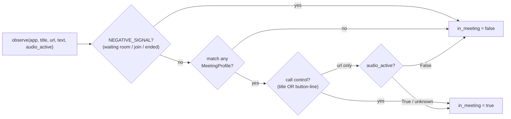

# 09 — Meeting & Workflow

## Purpose

Two lightweight, mostly-local classifiers that add semantic structure on top of raw
captures: detecting when the user is in a video call, and labeling each activity
frame with a workflow category.

Covers `deskmate/meeting/` and `deskmate/workflow/`.

## Meeting detection — `meeting/detector.py`

Detects active video calls by matching the focused window title, app name, and
browser URL against a set of hardcoded **profiles** (Teams, Zoom, Google Meet,
Slack Huddle, Discord, Webex, …), then requiring an active-call **signal** — and
guarding hard against the false positives a naive substring match produces.

- **`MeetingProfile`** — a tuple of `(name, app_tokens, url_tokens, title_tokens,
  call_signals)`. Matching a profile is necessary but **not sufficient**.
- **`MeetingObservation`** — records `in_meeting`, the matched signals, and the
  profile name for each observation.
- **Call signals are matched conservatively, NOT as a bare substring of the OCR
  dump.** A signal counts only when it appears in the **window title**
  (`_signal_in_title`) or as a **line-isolated, button-like control** in the
  captured text (`_signal_as_control` — a short token on its own line, the shape
  a11y/OCR gives a button). This kills the common false positives: a chat message
  saying "leave early", a Discord sidebar label "voice connected", code being
  read. (We only receive a flat text blob, so a line-isolation heuristic stands
  in for "matched a control element".)
- **`NEGATIVE_SIGNALS` veto** — a waiting-room / join-prompt / ended-call phrase
  (e.g. "host will let you in", "join now", "meeting ended", "等候室") forces
  `in_meeting=false` even if a profile matched and a "Leave" button is on screen.
  Ambiguous *in-call* controls (e.g. "start video") are deliberately **not** veto
  words.
- **`audio_active` corroboration** — when the only evidence is a meeting URL (no
  call control), the detector requires recent speech: `False` ⇒ treat as a parked
  lobby tab and don't open; `True` or `None` (unknown) ⇒ open. The daemon supplies
  this from `db.has_recent_speech()`, which counts recent non-empty transcriptions
  from **any** device **including the system-audio loopback** — so a *listen-only*
  call (mic muted, others talking) still reads as active. When audio capture is
  off the daemon passes `None`, never `False`, so disabling audio loses only the
  lobby guard, not legitimate URL-detected meetings. An explicit call control
  always opens a meeting regardless of audio, so a momentarily silent call with
  the in-call UI visible is still detected.
- **Video playback is not a meeting** — YouTube / Netflix / VLC don't match any
  profile, so audio alone never opens a meeting.
- **Lifecycle** — a call ends when `expire_if_idle` sees no fresh activity for
  `end_grace_seconds` (default 120 s). In the default **event-driven** capture
  mode there is no passive frame stream while the user is idle, so the capture
  loop calls a throttled `meeting_expire` tick (~every 30 s, via the
  `meeting_expire` callback) — otherwise a call that ends right as the user walks
  away would stay "open" until the next non-meeting frame. The legacy heartbeat
  loop already polled `expire_if_idle` each cycle.
- **Separation of concerns** — `detector.observe()` only classifies and logs
  observations; the daemon/API persists `meetings` rows. Whether a meeting is
  open also feeds reminder presence-gating — see
  [19 — Habits & reminders](19-habits-reminders.md).

## Workflow classification — `workflow/classifier.py`

Labels activity into categories — *coding, browsing, email, communication,
writing, meeting, other* — primarily with local keyword heuristics.

- **Local keyword groups** map app/window keywords to a workflow label (fast,
  offline, deterministic).
- **Optional remote override** — if the `WORKFLOW_CLASSIFIER` env var is set, the
  classifier POSTs `{app, title}` to that HTTP endpoint and uses its `{workflow}`,
  falling back to the local heuristic on timeout/error.
- **Caching** — results are cached per `(app_name, window_title)` so repeated
  lookups are free.

## Design trade-offs

1. **Heuristics first, model optional** — Both classifiers work fully offline with
   no model; an external classifier is an opt-in enhancement, never a requirement.
2. **Token-profile matching** — Meeting detection is transparent and easy to extend
   (add a profile) versus an opaque ML detector.
2a. **Layered false-positive guards over one fuzzy match** — profile match →
   conservative signal (title / button-line, never raw OCR substring) → negative
   veto → audio corroboration. Each layer is cheap and explainable; a false
   meeting both pollutes the meeting list and (now) wrongly silences reminders, so
   precision matters more than catching the last edge case.
3. **Detector is pure/observational** — Keeping persistence out of the detector
   makes it easy to test and reuse from multiple call sites.
4. **Per-key caching** — Window titles repeat constantly; caching avoids redundant
   classification on every frame.
