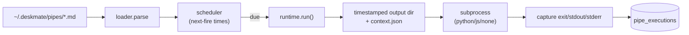

# 10 — Pipes

## Purpose

A lightweight scheduler for user-authored automation written as markdown (`.md`)
"pipes": a YAML frontmatter contract plus a body, executed on a schedule as an
isolated subprocess with declared permissions.

Covers `deskmate/pipes/`.

## Key files

| File | Role |
|------|------|
| `loader.py` | Parses `.md` files: YAML frontmatter (name, schedule/interval, runtime, permissions) + body |
| `runtime.py` | Durable execution: per-run output dir, JSON context, subprocess spawn, output capture, DB recording |
| `scheduler.py` | Background thread tracking next-fire time per pipe; ticks every second |

## Lifecycle

1. **Load** — `loader.py` reads each pipe's frontmatter (a minimal YAML subset —
   no full YAML engine) and separates it from the markdown body.
2. **Schedule** — `scheduler.py` computes each pipe's next-fire time from its
   `every Nh/Nm/Ns` interval (default ~5 min for cron-style strings it doesn't
   parse) and fires due pipes on its one-second tick.
3. **Run** — `runtime.py` creates a timestamped output directory, writes a
   `context.json` (granted permissions, DB path, API base URL, triggering frame
   IDs), spawns the declared runtime as a subprocess, and captures its exit code,
   stdout, and stderr.
4. **Record** — Execution start/finish is written to `pipe_executions` for history.

## Permission model

Each pipe declares the capabilities it needs (e.g. `read_db`, `write_db`,
`trigger_capture`, `call_llm`). These are passed to the subprocess via
`context.json`; the subprocess reads them and the runtime constrains what it's
handed (DB path / API base) accordingly, so a pipe only gets what it asked for.

## Design trade-offs

1. **Markdown-as-config** — Users hand-author pipes in `.md`; a tiny frontmatter
   parser keeps the contract simple and dependency-free.
2. **Subprocess isolation** — Each run is a separate process with its own output
   dir, so a misbehaving pipe can't corrupt the daemon.
3. **Context.json hand-off** — Permissions, paths, and trigger context are passed
   explicitly, making runs reproducible and auditable.
4. **Simple interval scheduling** — Interval seconds are the primary mechanism; no
   heavyweight cron engine is bundled.

> Note: `apps/` (doc 13) reuse the same `pipe.md` frontmatter convention but are
> orchestrated by `engine/app_scheduler.py`, which spawns `apps/<name>/app.py`.
