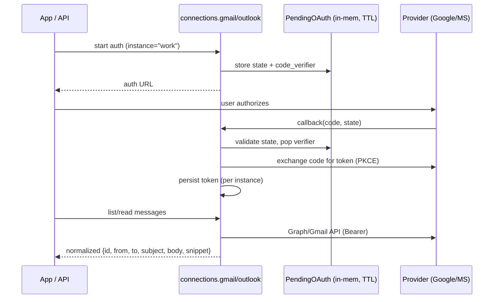

# 11 — Connections

## Purpose

Connect external email providers (Gmail, Outlook / Microsoft Graph) via OAuth and
normalize their messages into a common shape, so email-oriented apps
(`email-compose`, `email-digest`) and the Ask agent can read mail.

Covers `deskmate/connections/`.

## Key files

| File | Role |
|------|------|
| `gmail.py` | Gmail OAuth (PKCE), token storage, Gmail API fetch/send, MIME/base64 parsing |
| `outlook.py` | Microsoft Graph OAuth (PKCE), token storage, Graph Mail fetch + parsing |

## OAuth + fetch flow

- **PKCE OAuth** — Desktop-safe authorization (no client secret): `state` +
  `code_verifier` + `code_challenge`. Pending authorizations live in an in-memory
  dict with a ~10-minute TTL, so the flow is stateless across restarts.
- **Token storage** — Access/refresh tokens are persisted per provider and per
  **instance** (`_sanitize_instance()` namespacing) so multiple accounts (e.g.
  "work" and "personal") coexist.
- **Normalization** — `parse_gmail_message` and `parse_graph_message` both produce
  the *same* output dict shape (id, threadId, from, to, subject, body, snippet),
  so downstream code is provider-agnostic. Missing/malformed fields are handled
  defensively.

## Design trade-offs

1. **PKCE over client-secret flows** — Correct and safe for a local desktop app
   that can't keep a secret.
2. **Identical output shape across providers** — Apps depend on one schema, not on
   Gmail- vs. Graph-specific structures.
3. **In-memory pending store with TTL** — Simple and self-cleaning; auth state is
   transient by nature.
4. **Per-instance namespacing** — First-class multi-account support without
   schema changes.
