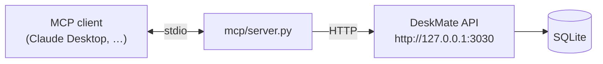

# 12 — MCP Server

## Purpose

Expose DeskMate's local activity data to Model Context Protocol (MCP) clients
(e.g. Claude Desktop) as tools, so an external assistant can search and read the
user's recorded activity.

Covers `deskmate/mcp/`.

## Key files

| File | Role |
|------|------|
| `server.py` | Stdio MCP server declaring tools that proxy to the local HTTP API |

## Design

- Runs as a **stdio** MCP server (started via `deskmate mcp`). It speaks the MCP
  protocol over stdin/stdout and declares a small tool set:
  `search`, `recent_frames`, `recent_events`, `capture_once`, `health`.
- Each tool is a thin proxy: it issues an HTTP GET/POST to the local DeskMate API
  and returns the JSON as MCP `TextContent`. The server holds **no direct DB
  access**, so it can run as a separate process from the daemon.
- `search` accepts the same optional filters as the API (app_name, window_name,
  time range, content_type, speaker_ids).
- **Graceful import** — if the `mcp` SDK isn't installed, importing the module is a
  no-op and the CLI surfaces a clear "install the mcp extra" message.

## Design trade-offs

1. **Proxy, don't reach in** — Going through the HTTP API keeps the MCP server
   decoupled from storage internals and reuses the same shaping/validation as every
   other client.
2. **Process isolation** — The MCP server can be launched independently by an MCP
   host without bringing up the capture daemon.
3. **Optional dependency** — The MCP SDK is an extra; its absence never affects the
   rest of DeskMate.
