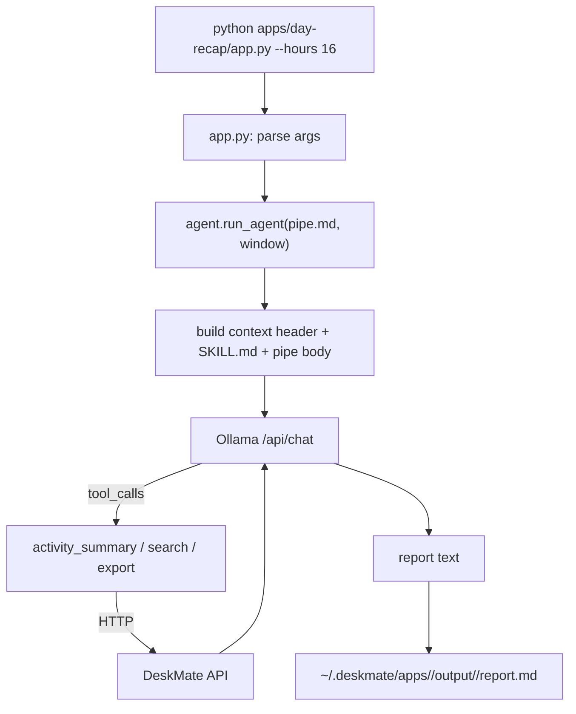
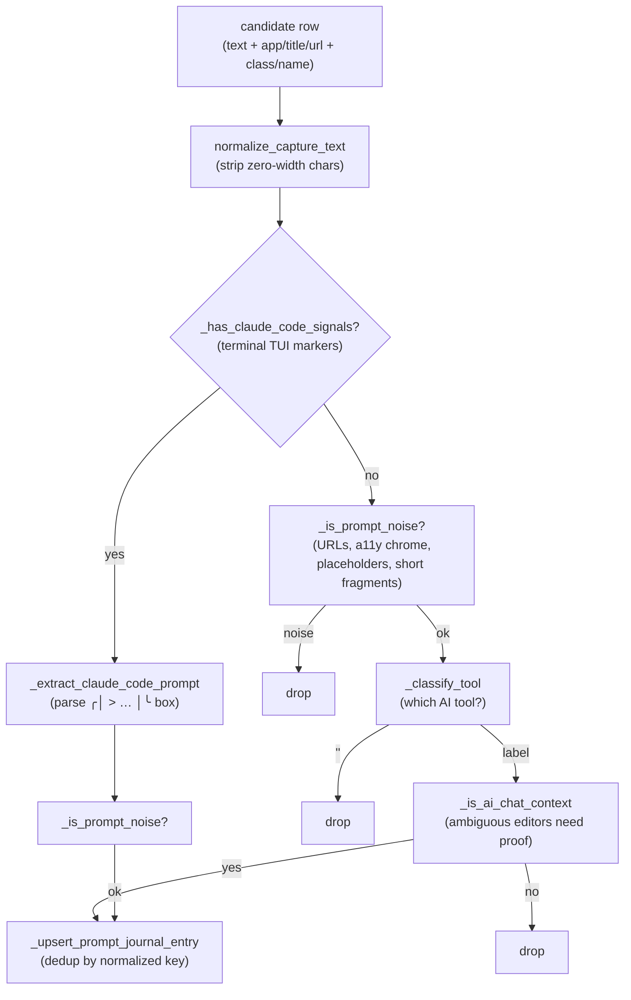

# 13 — Apps

## Purpose

User-facing local "mini-apps" that turn recorded activity into useful artifacts
(day recaps, standups, time breakdowns, email drafts, etc.) by combining a
markdown prompt (`pipe.md`), Python-side data pre-fetching from the DeskMate API,
and a local LLM (Ollama).

Covers `apps/`.

## Layout

```text
apps/
  agent.py          # shared LLM orchestrator (tool calling, rounds, logging)
  common.py         # shared helpers (API/DB connect, paths, time, arg parsing)
  SKILL.md          # system prompt: documents available tools + API shape
  README.md         # catalog of the apps
  <app-name>/
    app.py          # CLI entry: parse args → run_agent → write output
    pipe.md         # YAML frontmatter + markdown prompt (tools + report format)
```

The ten apps: `video-export`, `day-recap`, `ai-habits`, `meeting-summary`,
`standup-update`, `time-breakdown`, `ai-prompt-journal`, `todo-list`,
`email-compose`, `email-digest`.

## How an app runs



1. `app.py` parses CLI args and calls `run_agent()` with the app's `pipe.md` and a
   time window.
2. `agent.py` reads the pipe (frontmatter + body), assembles the prompt (context
   header with time window/timezone/API base + `SKILL.md` system prompt + pipe
   body), and sends it to Ollama.
3. The LLM emits tool calls (`activity_summary`, `search`, `export`); `agent.py`
   executes them against the DeskMate HTTP API and feeds results back, for a
   bounded number of rounds.
4. The final report is written to a timestamped output folder under
   `~/.deskmate/apps/<name>/output/`.

### Search behavior in apps

`apps/agent.py` now mirrors `engine/ask.py`: app-driven `/search` requests default
to `semantic=true`, which means apps **prefer hybrid retrieval** when they ask the
API for context. This is mainly useful for recap/summary-style apps, where the
prompt wording often differs from the exact captured text.

### The `timeline` tool in apps

`apps/agent.py` also mirrors the Ask agent's `timeline` tool: a pipe (or the
pipe-generating LLM) can call `timeline` to read the unified `/timeline/unified`
feed — a single, time-ordered, cross-source stream (screen / audio / input /
clipboard / window) with provenance and a confidence score. It is the right tool
for "what happened step by step" style reports, complementing `search` (keyword)
and `activity_summary` (aggregate stats). The endpoint, parameters and response
shape are documented for pipe authors in `apps/SKILL.md` and in
[15 — Fusion & timeline](15-fusion-timeline.md).

That default is still safe because the API remains the policy gate:

- if `cfg.search.semantic_enabled = true`, the API runs hybrid search
   (FTS5/BM25 + semantic + RRF fusion);
- if semantic search is disabled, the API ignores the semantic preference and
   falls back to keyword-only search.

So the app layer gets a single stable contract, while the server keeps control of
cost, model availability, and rollout.

## ai-prompt-journal: prompt acquisition

The `ai-prompt-journal` app reconstructs the prompts the user typed into AI
tools. Unlike recap/summary apps that let the LLM drive tool calls, this app
**pre-fetches and verifies** the prompts in Python first
(`_do_prompt_journal_prefetch` in `agent.py`), then hands only the verified rows
to the model for formatting. This keeps precision high (宁缺毋滥): a wrong "prompt"
is worse than a missing one.

### Where prompts come from

Nothing is logged per keystroke. The raw material is the **send-time snapshot**
the input hook records on Enter / Ctrl+Enter (see
[03 — Accessibility](03-accessibility.md)), plus periodic focused-input
snapshots. The prefetch pulls three SQL sources via `/raw_sql`:

| Source | Table | Notes |
|--------|-------|-------|
| **A** — send snapshots | `ui_events` (`event_type='text'`, `source='send'`) | Highest confidence; the only source carrying `focused_class` / `focused_name`. Also pulls standalone-terminal sends so a Claude Code TUI can be recognised. |
| **B** — focused input | `frame_accessibility` (focused role ∈ Edit/Document/TextArea…) | Catches text sitting in the active input field even with no send event. |
| **B2** — element table | `elements` (same roles) | Non-focused panes; empty unless `a11y.persist_elements = true`, so degrades gracefully. |

### Per-row filter pipeline

Every candidate row passes the same gate before it can become a journal entry:



- **Noise filter** (`_is_prompt_noise`) drops URLs and editor resource schemes
  (`vscode-webview://`, `file://`, …), screen-reader chrome, empty-box
  placeholders (`"Message Claude"`, `"Ask anything"`, …), and tiny non-CJK
  fragments.
- **Tool classification** (`_classify_tool`) resolves the AI tool from, in
  priority order: focused `ClassName`, focused `Name`, then app/title/URL.
- **Chat-context gate** (`_is_ai_chat_context`) lets dedicated clients and web
  chats through unconditionally, but requires *ambiguous* general-purpose
  editors (VS Code, Cursor) to show a positive chat signal, so ordinary code
  editing is never mistaken for a prompt.

### Per-tool recognition signals

| Tool class | Signal | Reliability |
|------------|--------|-------------|
| Web chats (ChatGPT, Claude, Gemini, …) | `browser_url` / `window_title` match | Generic & robust |
| Desktop clients (`*.exe`) | process name in `app_in` | Robust |
| **Cursor** | focused `ClassName = aislash-editor-input` | Verified |
| **VS Code Copilot** | focused `Name` starts with `"Chat Input"` | Requires `"editor.accessibilitySupport": "on"` — Monaco won't expose the value to UIA otherwise |
| **Claude Code** (terminal CLI) | TUI screen markers (`? for shortcuts`, `esc to interrupt`, …) + composer-box parse | Standalone terminals only (not the VS Code/Cursor integrated terminal); not yet live-validated |

New web / desktop tools are added by appending one entry to
`AI_PROMPT_JOURNAL_TARGETS`. Editor-embedded and CLI tools are *not* generic —
each needs a hand-tuned `ClassName` / `Name` / screen-marker fingerprint.

## Why this shape

- **`pipe.md` is the spec; `app.py` is just a runner.** Small local models (≈4B)
  struggle to plan multi-step tool calls reliably, so each app's Python encodes the
  orchestration (which tools, how many rounds, token budgets) while the markdown
  carries the prompt and report format.
- **Pre-fetch & verify.** Some apps (e.g. `ai-habits`) run searches in Python first
  and only feed verified hits to the LLM, which curbs hallucination.
- **Summary-first.** Recap/standup apps call `activity_summary` for broad context
  before targeted `search`.
- **Hybrid by default, fallback in the API.** Apps ask for the richer retrieval
   mode by default, but the server can still degrade to FTS5/BM25 when embeddings
   are disabled or unavailable.
- **Per-app budgets.** Different apps set different `max_search` / `max_rounds` /
  `num_predict` limits to match their needs.

## Shared modules

- **`common.py`** — connection/path helpers, ISO time generation, text truncation,
  and CLI arg parsing reused by every app.
- **`agent.py`** — the LLM orchestration loop (Ollama request shape, tool dispatch,
  round logging) shared across apps; mirrors `engine/ask.py` but tuned for
  report generation.
- **`SKILL.md`** — the system prompt documenting the tool set and API contract the
  apps rely on.

## Design trade-offs

1. **Markdown prompt + Python runner** — Plays to small-model strengths: deterministic
   orchestration in code, flexible wording in markdown.
2. **Reuse the HTTP API as the tool layer** — Same integration seam as `ask`/`mcp`;
   apps never touch the DB directly.
3. **Verified pre-fetch** — Trades a little extra Python work for materially more
   trustworthy LLM output.
4. **Timestamped output isolation** — Every run is reproducible and never clobbers a
   previous report.
5. **Precision-first prompt acquisition** — `ai-prompt-journal` would rather miss a
   prompt than invent one: generic URL/title/process matching is plug-and-play for
   web and desktop AI clients, while editor-embedded (Cursor, VS Code Copilot) and
   CLI tools (Claude Code) are recognised by hand-tuned UIA `ClassName` / `Name` /
   terminal-screen fingerprints gated behind a chat-context check.
