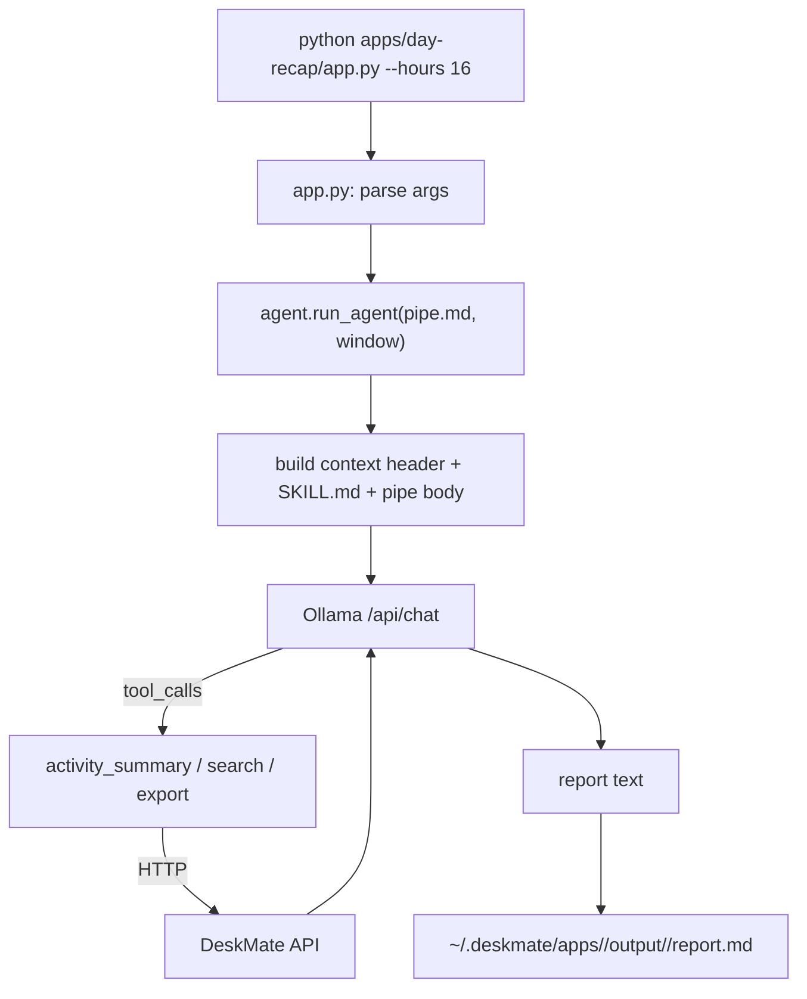

# 13 — Apps

## Purpose

User-facing local "mini-apps" that turn recorded activity into useful artifacts
(day recaps, standups, time breakdowns, email drafts, etc.) by combining a
markdown prompt (`pipe.md`), Python-side data pre-fetching from the DeskMate API,
and a local LLM (Ollama).

Covers `apps/`.

## Layout

```
apps/
  agent.py          # shared LLM orchestrator (tool calling, rounds, logging)
  common.py         # shared helpers (API/DB connect, paths, time, arg parsing)
  SKILL.md          # system prompt: documents available tools + API shape
  README.md         # catalog of the apps
  <app-name>/
    app.py          # CLI entry: parse args → run_agent → write output
    pipe.md         # YAML frontmatter + markdown prompt (tools + report format)
```

The ten apps: `video-export`, `day-recap`, `ai-habits`, `meeting-summary`,
`standup-update`, `time-breakdown`, `ai-prompt-journal`, `todo-list`,
`email-compose`, `email-digest`.

## How an app runs



1. `app.py` parses CLI args and calls `run_agent()` with the app's `pipe.md` and a
   time window.
2. `agent.py` reads the pipe (frontmatter + body), assembles the prompt (context
   header with time window/timezone/API base + `SKILL.md` system prompt + pipe
   body), and sends it to Ollama.
3. The LLM emits tool calls (`activity_summary`, `search`, `export`); `agent.py`
   executes them against the DeskMate HTTP API and feeds results back, for a
   bounded number of rounds.
4. The final report is written to a timestamped output folder under
   `~/.deskmate/apps/<name>/output/`.

## Why this shape

- **`pipe.md` is the spec; `app.py` is just a runner.** Small local models (≈4B)
  struggle to plan multi-step tool calls reliably, so each app's Python encodes the
  orchestration (which tools, how many rounds, token budgets) while the markdown
  carries the prompt and report format.
- **Pre-fetch & verify.** Some apps (e.g. `ai-habits`) run searches in Python first
  and only feed verified hits to the LLM, which curbs hallucination.
- **Summary-first.** Recap/standup apps call `activity_summary` for broad context
  before targeted `search`.
- **Per-app budgets.** Different apps set different `max_search` / `max_rounds` /
  `num_predict` limits to match their needs.

## Shared modules

- **`common.py`** — connection/path helpers, ISO time generation, text truncation,
  and CLI arg parsing reused by every app.
- **`agent.py`** — the LLM orchestration loop (Ollama request shape, tool dispatch,
  round logging) shared across apps; mirrors `engine/ask.py` but tuned for
  report generation.
- **`SKILL.md`** — the system prompt documenting the tool set and API contract the
  apps rely on.

## Design trade-offs

1. **Markdown prompt + Python runner** — Plays to small-model strengths: deterministic
   orchestration in code, flexible wording in markdown.
2. **Reuse the HTTP API as the tool layer** — Same integration seam as `ask`/`mcp`;
   apps never touch the DB directly.
3. **Verified pre-fetch** — Trades a little extra Python work for materially more
   trustworthy LLM output.
4. **Timestamped output isolation** — Every run is reproducible and never clobbers a
   previous report.
