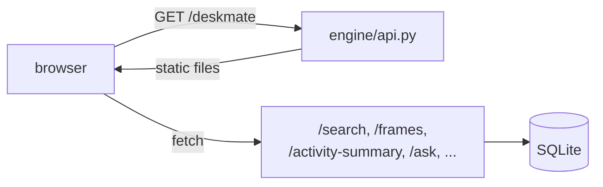

# 14 — Web UI

## Purpose

Provide a local web front-end for browsing captured activity, served by the HTTP
API at `/deskmate`.

Covers `deskmate/ui/`.

## Layout

| Path | Role |
|------|------|
| `ui/static/` | Front-end assets (HTML / CSS / JS) |
| `ui/__init__.py` | Package marker |

## Design

- The UI is a set of **static assets** mounted by `engine/api.py` at `/deskmate`; opening
  the `ui` CLI command starts the daemon + API and launches the browser there.
- The front-end is a thin client: it calls the same JSON endpoints
  (`/search`, `/frames`, `/transcripts`, `/activity-summary`, `/ask`, …) that every
  other consumer uses, and renders the results.
- No server-side rendering and no separate build server — the API process is the
  only thing that needs to run.
- The SPA's views are `<section id="view-NAME">` panels toggled by `setView()`; the
  **Model Service** view (`view-models`) drives the `/models/*` routes —
  see [20 — Model Service](20-model-service.md). The **Diagnostics** view
  (`view-doctor`) renders `GET /health/doctor` and follows the Settings-page
  language — see [21 — Diagnostics](21-diagnostics.md).

## Design trade-offs

1. **Static assets over a framework server** — One process serves both data and UI;
   nothing extra to deploy or keep in sync.
2. **API-driven thin client** — The UI shares the exact contract used by `ask`,
   `apps`, and `mcp`, so behavior stays consistent across surfaces.
3. **Local-only** — Served from `127.0.0.1` alongside the daemon, matching
   DeskMate's local-first, no-cloud posture.
