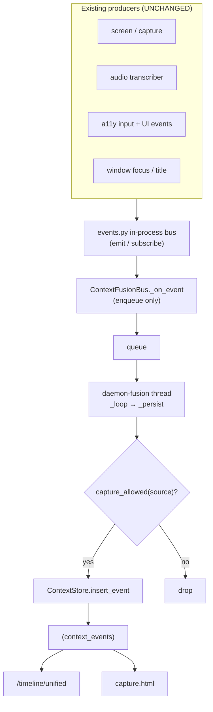
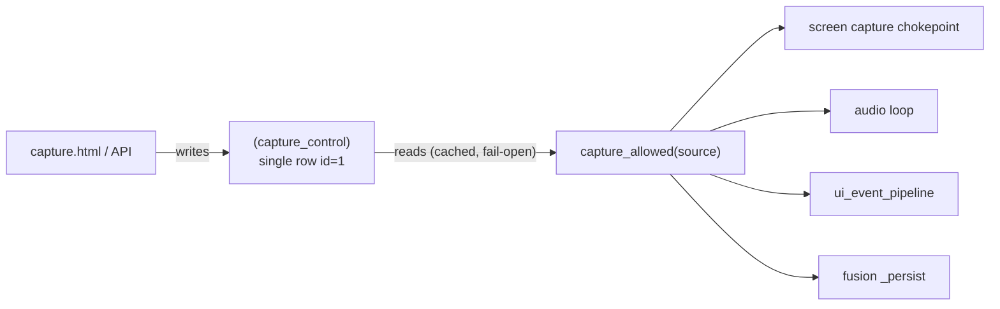

# 15 — Fusion, Unified Timeline & Capture Control

## Purpose

An **additive** subsystem that (a) fuses every capture source into a single
chronological "context bus" (`context_events`) so downstream consumers see one
provenance-tagged stream, and (b) gives the user runtime control over capture
(global pause with auto-resume, per-source switches, and a privacy "forget").
Nothing in the existing capture/producer path is modified — the fusion bus is a
pure **consumer** of the in-process event bus.

Covers `deskmate/fusion/` plus the `context_events` / `capture_control` schema
tables, the `/timeline/unified` + `/capture/*` API routes, and `capture.html`.

## Key files

| File | Role |
|------|------|
| `fusion/bus.py` | `ContextFusionBus` — subscribes to the in-process event bus, shapes each event, and persists it to `context_events` from a background thread |
| `fusion/store.py` | `ContextStore` — own SQLite connection for reading/writing the unified timeline (`insert_event`, `list_events`, `source_breakdown`, `forget_since`) |
| `fusion/control.py` | `CaptureControl` + fail-open `capture_allowed()` gate read by capture chokepoints |
| `db/schema.py` | `context_events` (the fused stream) and `capture_control` (single-row control surface) tables |
| `ui/static/capture.html` | Standalone control panel + unified timeline viewer |

## How fusion works

- **Zero producer changes.** Every capture path already emits to the in-process
  event bus (`FRAME_WRITTEN`, `AUDIO_TRANSCRIBED`, `CLIPBOARD`, `KEY_TEXT`,
  `CLICK`, `WINDOW_FOCUS`, `TITLE_CHANGE`, `VALUE_CHANGE`). The fusion bus is a
  late subscriber, so adding it touched no existing producer code.
- **Callback never blocks.** `_on_event` only enqueues; a dedicated
  `daemon-fusion` thread drains the queue and writes to SQLite, so capture
  latency is unaffected.
- **Provenance + confidence.** Each row is normalized to `{ts, source, kind,
  app_name, window_title, summary, payload_json, confidence, frame_id}`.
  `_MAPPING` maps event type → `(source, kind, control_source)`; `_CONFIDENCE`
  sets ASR rows to `0.8` and leaves UIA/window rows at `1.0`.
- **Own connection.** `ContextStore` uses a second SQLite connection
  (WAL + `busy_timeout=5000`), exactly like `habits/store.py`, so it is
  self-contained alongside the main `DatabaseManager`.

## Capture control

- **DB-mediated.** The API writes `capture_control`; the daemon's chokepoints
  read it. This keeps the API and daemon decoupled whether or not they share a
  process — the same pattern the habits module uses.
- **Fail-open gate.** `capture_allowed(source)` caches state for ~1s and returns
  `True` on *any* error, so a control bug can never silently stop recording.
  `set_*` mutators call `invalidate_cache()` so toggles take effect immediately.
- **Toggleable sources:** `screen`, `audio`, `input`, `clipboard`. Pause sets
  `pause_until` for auto-resume; `resume()` clears it.
- **Forget.** `db.forget_since(iso_cutoff)` deletes recent frames/UI/audio rows
  (and best-effort unlinks snapshot/audio files); `ContextStore.forget_since`
  removes the matching unified events.

## API surface

| Route | Method | Purpose |
|-------|--------|---------|
| `/capture/control` | GET | Current pause/auto-resume + per-source switch state |
| `/capture/pause` | POST | Pause capture (optional `minutes` for auto-resume) |
| `/capture/resume` | POST | Resume capture |
| `/capture/source` | POST | Toggle one source (`source`, `enabled`) |
| `/capture/forget` | POST | Delete the last `minutes` of captured data |
| `/timeline/unified` | GET | Fused feed (`since`, `until`, `sources`, `limit`≤1000) |
| `/timeline/unified/breakdown` | GET | Per-source event counts since a time |
| `/capture/ui` | GET | Serves `capture.html` |

Response shape for `/timeline/unified` is `{ "data": [Event…], "total": N }`,
where each Event has `ts, source, kind, app_name, window_title, summary, payload
(parsed), confidence, frame_id`.

## How this strengthens Ask & Apps

Both the **Ask agent** (`engine/ask.py`) and the **Apps agent** (`apps/agent.py`)
gained a `timeline` tool that reads `/timeline/unified`. This adds a capability
neither had before: answering **strongly time-ordered, cross-source** questions
("what did I do step by step", "what did I copy/paste", "what did I type during
the meeting") from a single fused feed — complementing `search` (keyword) and
`activity_summary` (aggregate stats). See [08 — Engine & Intelligence](08-engine-intelligence.md)
and [13 — Apps](13-apps.md).

## Configuration

`FusionConfig` (`config.py`, env-prefixed `DESKMATE_FUSION__*`):

| Field | Default | Meaning |
|-------|---------|---------|
| `enabled` | `true` | Run the fusion subsystem at all |
| `record_window_events` | `true` | Persist window focus/title/value events |
| `summary_max_chars` | `200` | Max chars of any text payload kept in the feed |

Runtime pause/per-source toggles live in the `capture_control` table, **not** in
config, so they can change without a restart.

## Design trade-offs

1. **Consumer-only fusion** — Subscribing to the existing bus instead of editing
   producers keeps the change purely additive and risk-free for capture.
2. **Enqueue + background persist** — Protects capture latency; SQLite writes
   never happen on the producer's thread.
3. **Fail-open control gate** — A privacy control must never become a reliability
   regression; on error it defaults to "keep recording".
4. **DB-mediated control** — Works across process boundaries and mirrors the
   habits module, avoiding new IPC.
