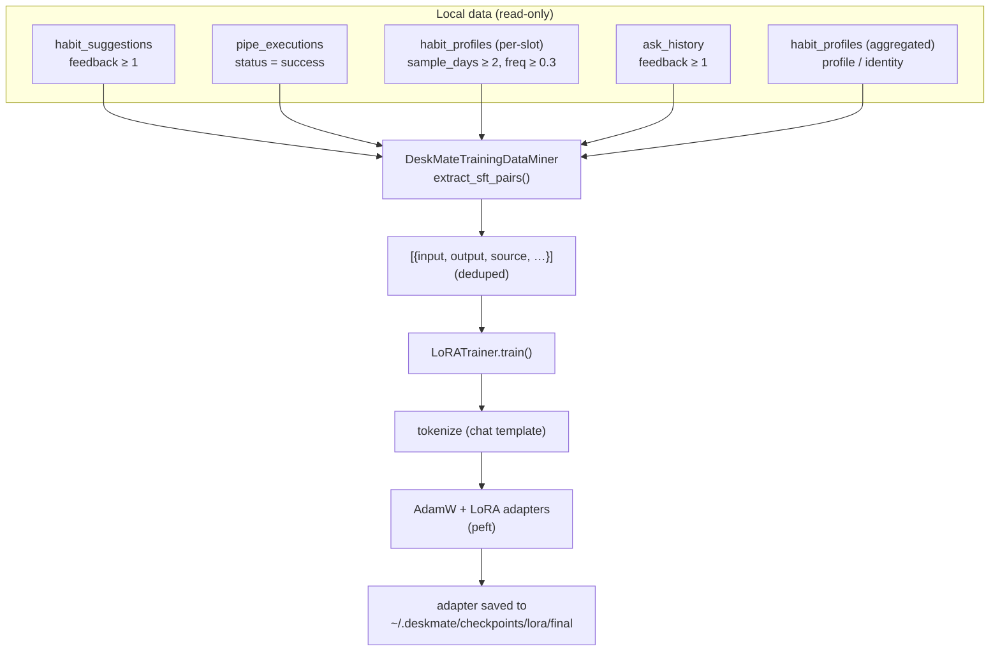

# 16 — Learning & LoRA Training

## Purpose

An **opt-in, additive** subsystem that fine-tunes a small local causal LM with
LoRA/QLoRA adapters using supervised pairs mined from DeskMate's own data. None
of the capture/storage code is modified; the miner only **reads** existing
tables, and the heavy ML dependencies live behind an optional extra.

Covers `deskmate/learning/training/`, the `TrainingConfig` config block, the
`train-lora` CLI command, and the `/training/*` API routes.

## Key files

| File | Role |
|------|------|
| `learning/training/lora.py` | `LoRATrainer` + `LoRATrainingConfig` — LoRA/QLoRA fine-tuning over `{input, output}` pairs (guarded torch/transformers/peft imports) |
| `learning/training/data.py` | `DeskMateTrainingDataMiner` — mines SFT pairs from five local sources via its own read-only connection |
| `config.py` | `TrainingConfig` — model, data-mining and LoRA hyperparameters |
| `engine/cli.py` | `deskmate train-lora` command (with `--dry-run` preview) |
| `engine/api.py` | `GET /training/data` (preview) + `POST /training/lora` (train) |

## Data flow



### The five data sources

DeskMate derives supervised pairs from local tables. Each source has its
own **quality gate** so that
only trustworthy, high-signal rows reach the training set. The `source` selector
(`TrainingConfig.sources` / `--sources`) maps to a config key, and each config
key maps to one extractor method on `DeskMateTrainingDataMiner`:

| Config key | `source` tag | From table | Quality gate | input → output |
|------------|--------------|-----------|--------------|----------------|
| `habits`   | `habit_suggestion` | `habit_suggestions` | `feedback ≥ min_feedback` (user marked useful) | trigger context → the accepted coaching nudge |
| `pipes`    | `pipe_execution`   | `pipe_executions`   | `status = 'success'` & non-empty output | "Run the '\<pipe\>' assistant…" → the produced report |
| `behavior` | `behavior`         | `habit_profiles`    | `sample_days ≥ 2` & `frequency ≥ 0.3` | "What do I usually do on \<day\> around \<HH:MM\>?" → routine description |
| `ask`      | `ask`              | `ask_history`       | `feedback ≥ min_feedback` (user clicked 👍 **有用**) | the user's own question → the grounded answer |
| `profile`  | `profile`          | `habit_profiles` (aggregated) | `sample_days ≥ 3` & `frequency ≥ 0.4`, ≥ 3 rows | synthesized "who is this user" identity Q&A — see [17 — User profile](17-user-profile.md) |

**Defaults**: `sources = ["habits", "pipes", "behavior", "ask", "profile"]`.

The earlier `timeline` source (mining `context_events`) was **removed**: it was
mostly raw echo ("what did I type in Code.exe?" → the literal typed text), which
is low-signal and privacy-sensitive. The unified timeline still exists for
browsing in the Capture view ([15 — Fusion & timeline](15-fusion-timeline.md));
it is just no longer a training source.

All pairs additionally pass a shared quality gate — min length, an output-length
cap, a natural-language check, and `input ≠ output` — and are deduplicated
whitespace/case-insensitively with a cap on identical outputs so no handful of
rows dominates the gradient.

#### Per-source detail

1. **`habits`** — `_from_habit_suggestions`. Every reminder the coaching rules fire
   (overwork, break, late-night, …) is logged with its trigger context. Only rows
   the user **rated useful** become pairs:
   - input: `"My recent activity shows: <ctx>. What helpful nudge should I get?"`
     (or `"The '<rule>' pattern was detected…"` when context is empty)
   - output: the exact nudge message that was shown

2. **`pipes`** — `_from_pipe_executions`. Each automation pipe run records its
   produced report. Only **successful** runs with non-empty output are kept:
   - input: `"Run the '<pipe>' assistant and report the result."`
   - output: the report the pipe actually generated

3. **`behavior`** — `_from_habit_profiles`. The learned routine profile (per
   weekday/weekend × 30-min slot: dominant category, top app, avg minutes,
   frequency). Only **statistically stable** slots (≥2 days, ≥30% frequency) are
   turned into Q&A:
   - input: `"What do I usually do on weekdays around 09:00?"`
   - output: `"Typically Coding, usually in Code.exe, for about 25 min (on 80% of days)."`

4. **`ask`** — `_from_ask_history`. Every answered Ask query is logged; the UI shows
   a **👍 有用 / 👎 没用** control under each answer. Only answers the user marked
   useful (`feedback ≥ min_feedback`) are mined — the same gate as `habits` — so a
   casual or wrong answer never leaks into training:
   - input: the user's original question
   - output: the grounded answer that was accepted

5. **`profile`** — `_from_user_profile`. Aggregates the whole `habit_profiles`
   table into a few high-level identity pairs (top apps, dominant categories,
   weekday/weekend rhythm) so the model learns *who the user is*, not just
   isolated slots. Skipped entirely when there is too little signal. Full
   write-up: [17 — User profile](17-user-profile.md).

#### Shared post-processing (quality gate)

- `_keep` drops a pair when: either side is shorter than `min_chars`; the output
  exceeds the output-length cap (length-teaching, not preference); the output
  isn't natural language; or `input == output` (echo).
- `(input, output)` duplicates are collapsed whitespace/case-insensitively
  (first occurrence kept), with a cap on how many times the **same output** may
  recur so a few repeated rows can't dominate the gradient; total capped at
  `max_pairs`.
- The trainer only ever reads the `input` / `output` keys; the extra metadata
  (`source`, `rule`, `pipe`, `kind`, `feedback`, `ts`) is for preview/debugging.

### The trainer

`LoRATrainer` is a faithful port: guarded imports mean the module imports cleanly
without the `[training]` extra, and the trainer raises `ImportError` only at
construction when `torch` is missing. `train()` tokenizes via the model's chat
template (falling back to a manual `<|user|>/<|assistant|>` format), runs an
AdamW loop with gradient clipping, optional gradient checkpointing and 4-bit
QLoRA, and saves per-epoch + `final` adapters. Device selection prefers an
explicit hint > cuda > mps > cpu.

## CLI

```bash
# Preview the mined data without training (no torch needed)
deskmate train-lora --dry-run

# Train (requires: pip install 'deskmate[training]')
deskmate train-lora --epochs 3 --sources habits,pipes,behavior,ask,profile

# Inspect the exact dataset a run would use, as JSONL, without training
deskmate train-lora --export ~/.deskmate/sft_preview.jsonl
```

Flags: `--model`, `--output-dir`, `--sources`, `--epochs`, `--max-pairs`,
`--dry-run`, `--export`. Defaults come from `TrainingConfig`.

## API surface

| Route | Method | Purpose |
|-------|--------|---------|
| `/training/data` | GET | Preview mined pairs: `sources`, per-source `breakdown`, `total`, and a `sample` |
| `/training/lora` | POST | Mine + train; returns the training summary. Returns **503** if `torch` is not installed |

`POST /training/lora` runs the (blocking) training in a threadpool and accepts
`sources`, `model`, `epochs`, `max_pairs`, `output_dir` in the JSON body.

## Configuration

`TrainingConfig` (`config.py`, env-prefixed `DESKMATE_TRAINING__*`):

| Field | Default | Meaning |
|-------|---------|---------|
| `enabled` | `true` | Whether the subsystem is exposed |
| `model_name` | `Qwen/Qwen3-0.6B` | Base model to adapt |
| `output_dir` | `""` → `~/.deskmate/checkpoints/lora` | Adapter output dir |
| `sources` | `["habits","pipes","behavior","ask","profile"]` | Which sources to mine |
| `min_feedback` / `min_chars` | `1` / `8` | Quality thresholds (gates `habits` & `ask`) |
| `limit_per_source` / `max_pairs` | `2000` / `5000` | Mining caps |
| `lora_rank` / `lora_alpha` / `lora_dropout` | `16` / `32` / `0.05` | LoRA params |
| `target_modules` | `["q_proj","v_proj"]` | Modules to adapt |
| `num_epochs` / `batch_size` / `learning_rate` | `3` / `4` / `2e-5` | Training params |
| `max_seq_length` / `use_4bit` | `2048` / `false` | Sequence length / QLoRA toggle |

## Dependencies

The `[training]` extra pulls `torch`, `transformers`, `peft`, `accelerate`:

```bash
pip install 'deskmate[training]'
```

Without it, `import deskmate.learning.training` still works (so the CLI/API load),
`--dry-run` and `/training/data` still mine and preview data, and only actual
training is gated.

## Design trade-offs

1. **Read-only miner** — Training never touches the capture/storage write path;
   it opens its own read connection, mirroring `fusion/store.py`.
2. **Guarded ML imports + optional extra** — Keeps the base install light and the
   module importable everywhere; failures are explicit and actionable.
3. **Local sources, each with a quality gate** — Reuses signals DeskMate
   already has (user 👍 feedback on nudges and Ask answers, successful pipe
   outputs, statistically stable behavior profiles) instead of requiring a
   separate labeling step. `habits` and `ask` gate on explicit user approval,
   `pipes` on execution success, `behavior` and `profile` on statistical
   significance.
4. **Raw timeline echo dropped** — the former `context_events` source produced
   mostly low-signal, privacy-sensitive echo pairs and was removed entirely; the
   unified timeline remains for browsing only ([15](15-fusion-timeline.md)).
5. **Identity vs routine split** — `profile` ([17](17-user-profile.md))
   synthesizes a few "who is this user" pairs, complementing `behavior`'s
   per-slot routine pairs, so the model gains a stable self-image.
6. **Opt-in only** — Nothing trains automatically; the user invokes the CLI or API
   explicitly.
