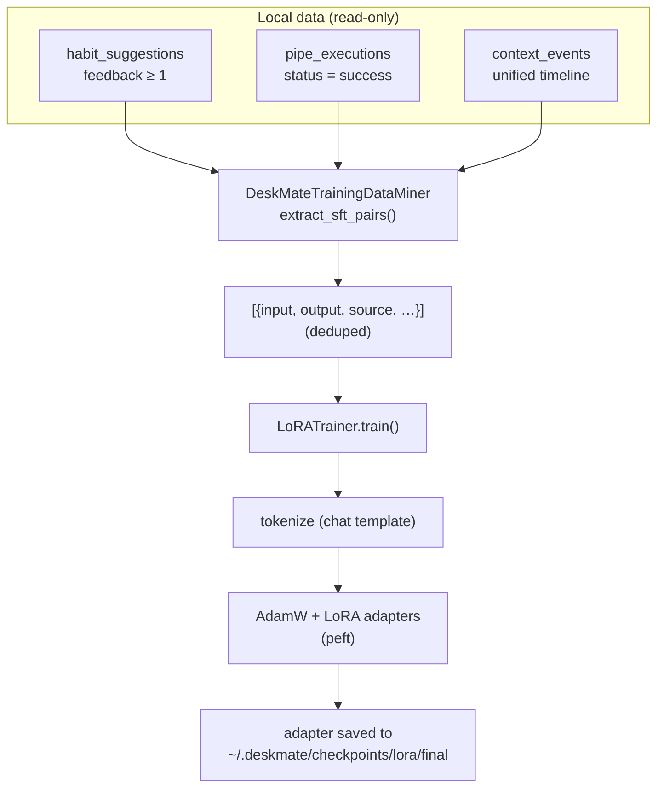

# 16 — Learning & LoRA Training

## Purpose

An **opt-in, additive** subsystem that fine-tunes a small local causal LM with
LoRA/QLoRA adapters using supervised pairs mined from DeskMate's own data. It is
a port of OpenJarvis's LoRA training pipeline, adapted to DeskMate's local SQLite
sources. None of the capture/storage code is modified; the miner only **reads**
existing tables, and the heavy ML dependencies live behind an optional extra.

Covers `deskmate/learning/training/`, the `TrainingConfig` config block, the
`train-lora` CLI command, and the `/training/*` API routes.

## Key files

| File | Role |
|------|------|
| `learning/training/lora.py` | `LoRATrainer` + `LoRATrainingConfig` — LoRA/QLoRA fine-tuning over `{input, output}` pairs (guarded torch/transformers/peft imports) |
| `learning/training/data.py` | `DeskMateTrainingDataMiner` — mines SFT pairs from three local sources via its own read-only connection |
| `config.py` | `TrainingConfig` — model, data-mining and LoRA hyperparameters |
| `engine/cli.py` | `deskmate train-lora` command (with `--dry-run` preview) |
| `engine/api.py` | `GET /training/data` (preview) + `POST /training/lora` (train) |

## Data flow



### The three data sources

The miner is the DeskMate analog of OpenJarvis's `TrainingDataMiner` (which read
an agent trace store). DeskMate has no such store, so pairs come from:

| Source tag | From | input → output |
|------------|------|----------------|
| `habit_suggestion` | `habit_suggestions` the user marked useful (`feedback ≥ min_feedback`) | trigger context → the accepted coaching message |
| `pipe_execution` | successful `pipe_executions` with non-empty output | "Run the '<pipe>' assistant…" → the produced report |
| `timeline:<src>` | unified `context_events` | observable window state → the fused human-readable summary |

- Pairs shorter than `min_chars` (either side) are dropped.
- Timeline rows whose summary merely restates the window title are skipped
  (avoids degenerate pairs).
- `(input, output)` duplicates are collapsed, first occurrence kept, capped at
  `max_pairs`.

### The trainer

`LoRATrainer` is a faithful port: guarded imports mean the module imports cleanly
without the `[training]` extra, and the trainer raises `ImportError` only at
construction when `torch` is missing. `train()` tokenizes via the model's chat
template (falling back to a manual `<|user|>/<|assistant|>` format), runs an
AdamW loop with gradient clipping, optional gradient checkpointing and 4-bit
QLoRA, and saves per-epoch + `final` adapters. Device selection prefers an
explicit hint > cuda > mps > cpu.

## CLI

```bash
# Preview the mined data without training (no torch needed)
deskmate train-lora --dry-run

# Train (requires: pip install 'deskmate[training]')
deskmate train-lora --epochs 3 --sources habits,pipes,timeline
```

Flags: `--model`, `--output-dir`, `--sources`, `--epochs`, `--max-pairs`,
`--dry-run`. Defaults come from `TrainingConfig`.

## API surface

| Route | Method | Purpose |
|-------|--------|---------|
| `/training/data` | GET | Preview mined pairs: `sources`, per-source `breakdown`, `total`, and a `sample` |
| `/training/lora` | POST | Mine + train; returns the training summary. Returns **503** if `torch` is not installed |

`POST /training/lora` runs the (blocking) training in a threadpool and accepts
`sources`, `model`, `epochs`, `max_pairs`, `output_dir` in the JSON body.

## Configuration

`TrainingConfig` (`config.py`, env-prefixed `DESKMATE_TRAINING__*`):

| Field | Default | Meaning |
|-------|---------|---------|
| `enabled` | `true` | Whether the subsystem is exposed |
| `model_name` | `Qwen/Qwen3-0.6B` | Base model to adapt |
| `output_dir` | `""` → `~/.deskmate/checkpoints/lora` | Adapter output dir |
| `sources` | `["habits","pipes","timeline"]` | Which sources to mine |
| `min_feedback` / `min_chars` | `1` / `8` | Quality thresholds |
| `limit_per_source` / `max_pairs` | `2000` / `5000` | Mining caps |
| `lora_rank` / `lora_alpha` / `lora_dropout` | `16` / `32` / `0.05` | LoRA params |
| `target_modules` | `["q_proj","v_proj"]` | Modules to adapt |
| `num_epochs` / `batch_size` / `learning_rate` | `3` / `4` / `2e-5` | Training params |
| `max_seq_length` / `use_4bit` | `2048` / `false` | Sequence length / QLoRA toggle |

## Dependencies

The `[training]` extra pulls `torch`, `transformers`, `peft`, `accelerate`:

```bash
pip install 'deskmate[training]'
```

Without it, `import deskmate.learning.training` still works (so the CLI/API load),
`--dry-run` and `/training/data` still mine and preview data, and only actual
training is gated.

## Design trade-offs

1. **Read-only miner** — Training never touches the capture/storage write path;
   it opens its own read connection, mirroring `fusion/store.py`.
2. **Guarded ML imports + optional extra** — Keeps the base install light and the
   module importable everywhere; failures are explicit and actionable.
3. **Three local sources with quality gates** — Reuses signals DeskMate already
   has (user feedback, successful pipe outputs, the fused timeline) instead of
   requiring a separate labeling step.
4. **Opt-in only** — Nothing trains automatically; the user invokes the CLI or API
   explicitly.
