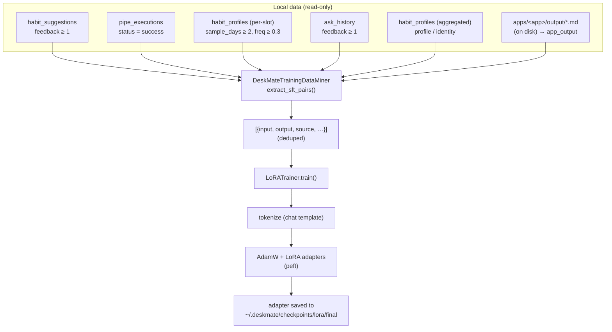

# 16 — Learning & LoRA Training

## Purpose

An **opt-in, additive** subsystem that fine-tunes a small local causal LM with
LoRA/QLoRA adapters using supervised pairs mined from DeskMate's own data. None
of the capture/storage code is modified; the miner only **reads** existing
tables, and the heavy ML dependencies live behind an optional extra.

Covers `deskmate/learning/training/`, the `TrainingConfig` config block, the
`train-lora` CLI command, and the `/training/*` API routes.

## Key files

| File | Role |
|------|------|
| `learning/training/lora.py` | `LoRATrainer` + `LoRATrainingConfig` — LoRA/QLoRA fine-tuning over `{input, output}` pairs (Unsloth backend, transformers+peft fallback; guarded imports) |
| `learning/training/data.py` | `DeskMateTrainingDataMiner` — mines SFT pairs from six local sources via its own read-only connection |
| `config.py` | `TrainingConfig` — model, data-mining and LoRA hyperparameters |
| `engine/cli.py` | `deskmate train-lora` command (with `--dry-run` preview) |
| `engine/api.py` | `GET /training/data` (preview) + `POST /training/lora` (train) |

## Data flow



### How mining works (the pipeline)

`DeskMateTrainingDataMiner.extract_sft_pairs(sources, limit_per_source, max_pairs)`
is the single entry point. It runs entirely **read-only** against the local
database — nothing is written, and capture keeps running unaffected.

1. **Own read connection.** The miner opens its *own* SQLite connection to
   `~/.deskmate/data.db` with `busy_timeout` set. WAL mode lets it read safely
   while the main `DatabaseManager` keeps writing (mirrors `fusion/store.py`).
2. **Per-source extract.** For each requested source it calls one
   `_from_<source>()` method (table below). Each method is an independent SQL
   query — or, for `apps`, a scan of on-disk report files — that turns rows into
   `{input, output, source, …}` dicts. `limit_per_source` caps how many rows each
   scans (most-recent first), so one prolific source can't dominate. A source
   that finds nothing (or whose signal is too thin, e.g. `profile`) simply
   contributes zero pairs.
3. **Per-source quality gate.** Inside each method, `_keep(input, output)` rejects
   pairs that are too short, whose output exceeds the length cap, that aren't
   natural language, or where `input == output` (which would teach the model to
   echo). Each source also applies its own provenance gate — e.g. a useful 👍
   rating, a successful run, or a statistically stable routine.
4. **Merge + dedup + cap.** All sources' pairs are concatenated, then collapsed:
   `(input, output)` duplicates are dropped whitespace/case-insensitively (first
   kept), the **same output** may recur at most `_MAX_DUP_OUTPUT` (3) times so a
   few identical reports/answers can't skew the gradient, and the total is capped
   at `max_pairs`. The deduped list is what `train()` receives.

```text
extract_sft_pairs()
  ├─ _from_habit_suggestions()  ─┐
  ├─ _from_pipe_executions()     │  each: SQL/scan → rows → _keep() gate → pairs
  ├─ _from_habit_profiles()      │
  ├─ _from_ask_history()         ├─▶ concat ─▶ dedupe (incl. max-dup-output)
  ├─ _from_user_profile()        │            ─▶ cap at max_pairs ─▶ pairs[]
  └─ _from_app_outputs()        ─┘
```

**Preview without training.** `GET /training/data` and `deskmate train-lora
--dry-run` run exactly this pipeline and return the pairs (plus a per-source
`breakdown` count) so you can inspect *what* would be trained on; `--export
file.jsonl` writes them out for eyeballing. Nothing trains until you call
`POST /training/lora` (or omit `--dry-run`).

### The six data sources

DeskMate derives supervised pairs from local tables. Each source has its
own **quality gate** so that
only trustworthy, high-signal rows reach the training set. The `source` selector
(`TrainingConfig.sources` / `--sources`) maps to a config key, and each config
key maps to one extractor method on `DeskMateTrainingDataMiner`:

| Config key | `source` tag | From table | Quality gate | input → output |
|------------|--------------|-----------|--------------|----------------|
| `habits`   | `habit_suggestion` | `habit_suggestions` | `feedback ≥ min_feedback` (user marked useful) | trigger context → the accepted coaching nudge |
| `pipes`    | `pipe_execution`   | `pipe_executions`   | `status = 'success'` & non-empty output | "Run the '\<pipe\>' assistant…" → the produced report |
| `behavior` | `behavior`         | `habit_profiles`    | `sample_days ≥ 2` & `frequency ≥ 0.3` | "What do I usually do on \<day\> around \<HH:MM\>?" → routine description |
| `ask`      | `ask`              | `ask_history`       | `feedback ≥ min_feedback` (user clicked 👍 **有用**) | the user's own question → the grounded answer |
| `profile`  | `profile`          | `habit_profiles` (aggregated) | `sample_days ≥ 3` & `frequency ≥ 0.4`, ≥ 3 rows | synthesized "who is this user" identity Q&A — see [17 — User profile](17-user-profile.md) |
| `apps`     | `app_output`       | `~/.deskmate/apps/<app>/output/<run>/*.md` (on disk) | non-empty report, ≤ `_MAX_REPORT_CHARS` | a friendly per-app instruction → the report the app wrote |

**Defaults**: `sources = ["habits", "apps", "pipes", "behavior", "ask", "profile"]`.

The earlier `timeline` source (mining `context_events`) was **removed**: it was
mostly raw echo ("what did I type in Code.exe?" → the literal typed text), which
is low-signal and privacy-sensitive. The unified timeline still exists for
browsing in the Capture view ([15 — Fusion & timeline](15-fusion-timeline.md));
it is just no longer a training source.

All pairs additionally pass a shared quality gate — min length, an output-length
cap, a natural-language check, and `input ≠ output` — and are deduplicated
whitespace/case-insensitively with a cap on identical outputs so no handful of
rows dominates the gradient.

#### Per-source detail

1. **`habits`** — `_from_habit_suggestions`. Every reminder the coaching rules fire
   (overwork, break, late-night, …; see [19 — Habits & reminders](19-habits-reminders.md)
   for the trigger logic) is logged with its trigger context. Only rows
   the user **rated useful** become pairs:
   - input: a Chinese prompt with the trigger context rendered as **natural
     language** — e.g. `"根据我最近的活动（我一直在浏览网页，当前用的是 chrome.exe；
     已连续使用屏幕约 15 分钟…；现在是 23:00 左右），给我一句有帮助的提醒。"` (or a
     rule-name phrasing when the context is empty). `_render_context` phrases the
     `context_json` blob; it must **not** dump the raw `state={…}` dict.
   - output: the exact nudge message that was shown (Chinese, as the rules emit it)

2. **`pipes`** — `_from_pipe_executions`. Each automation pipe run records its
   produced report. Only **successful** runs with non-empty output are kept:
   - input: `"Run the '<pipe>' assistant and report the result."`
   - output: the report the pipe actually generated

3. **`behavior`** — `_from_habit_profiles`. The learned routine profile (per
   weekday/weekend × 30-min slot: dominant category, top app, avg minutes,
   frequency). Only **statistically stable** slots (≥2 days, ≥30% frequency) are
   turned into Q&A. **Bilingual**: each slot emits an English *and* a Chinese pair:
   - EN — input `"What do I usually do on weekdays around 09:00?"` → output
     `"Typically coding, usually in Code.exe, for about 25 min (on 80% of days)."`
   - ZH — input `"工作日 09:00 左右我通常在做什么？"` → output
     `"一般是写代码，通常用 Code.exe，大约 25 分钟（80% 的天数如此）。"`

4. **`ask`** — `_from_ask_history`. Every answered Ask query is logged; the UI shows
   a **👍 有用 / 👎 没用** control under each answer. Only answers the user marked
   useful (`feedback ≥ min_feedback`) are mined — the same gate as `habits` — so a
   casual or wrong answer never leaks into training:
   - input: the user's original question
   - output: the grounded answer that was accepted

5. **`profile`** — `_from_user_profile`. Aggregates the whole `habit_profiles`
   table into a few high-level identity pairs (top apps, dominant categories,
   weekday/weekend rhythm) so the model learns *who the user is*, not just
   isolated slots. Skipped entirely when there is too little signal. Like
   `behavior` it is synthetic, so each identity fact is emitted in **both English
   and Chinese** (e.g. `"What do I mainly work on?"` and `"我主要在做什么？"`).
   Full write-up: [17 — User profile](17-user-profile.md).

6. **`apps`** — `_from_app_outputs`. Mines the markdown the LLM **apps** wrote to
   `~/.deskmate/apps/<app>/output/<run>/*.md` (day-recap, user-profile,
   habit-report, standup, …) — the actual reports, **read from disk**, newest
   runs first. Each becomes an (instruction → report) pair so the fine-tuned
   model learns to produce these in the user's own style:
   - input: a friendly per-app instruction (e.g. user-profile → "根据我近期的活动，
     总结我的用户画像…"); unknown apps get a generic "运行「\<app\>」助手并输出结果。"
   - output: the report, with any trailing `_时间窗…_` metadata footer stripped
   - Long-form: app reports are the *target*, so they use a higher cap
     (`_MAX_REPORT_CHARS`, 6000) than the short-nudge default (`_MAX_OUTPUT_CHARS`,
     1500).

   > `apps` vs `pipes`: they look similar but read different places. `pipes`
   > mines the `pipe_executions` **DB table** (the older scheduled-pipe runtime);
   > `apps` mines the on-disk markdown the My-Apps runner produces. The new
   > synthesis apps ([13 — Apps](13-apps.md)) only write to disk, so `apps` is
   > what captures them.

#### Language of the dataset

The dataset is **bilingual (zh + en)**, but how each source gets there differs by
whether its text is *synthesized* by the miner or is *real user data*:

| Source | input | output | Language strategy |
|--------|-------|--------|-------------------|
| `behavior` | synthetic | synthetic | **Both** — every pair emitted in EN and ZH |
| `profile`  | synthetic | synthetic | **Both** — every fact emitted in EN and ZH |
| `habits`   | synthetic | real (rule message) | input rendered as natural **Chinese**; output is the message as fired |
| `ask`      | real (user question) | real (LLM answer) | **Follows the user** — whatever language it happened in |
| `apps` / `pipes` | synthetic instruction | real report | instruction is Chinese; report is whatever the app/pipe wrote |

**Why not translate everything?** The two fully-synthetic sources are cheap and
safe to render twice, so they are. But the real-data sources (`ask` answers, app
`apps`/`pipes` reports) are *ground truth* — machine-translating them to
manufacture a second language would teach the model translationese and risk
corrupting real content, so they are kept in their **original language**. The net
effect is still a dataset containing both languages, without any machine
translation of user data. `_category_word()` maps the internal category enum
(`coding`/`browsing`/…) to the right display word per language so an enum never
leaks as a bare English token into a Chinese sentence.

#### Shared post-processing (quality gate)

- `_keep` drops a pair when: either side is shorter than `min_chars`; the output
  exceeds the output-length cap (length-teaching, not preference); the output
  isn't natural language; or `input == output` (echo).
- `(input, output)` duplicates are collapsed whitespace/case-insensitively
  (first occurrence kept), with a cap on how many times the **same output** may
  recur so a few repeated rows can't dominate the gradient; total capped at
  `max_pairs`.
- The trainer only ever reads the `input` / `output` keys; the extra metadata
  (`source`, `rule`, `pipe`, `kind`, `feedback`, `ts`) is for preview/debugging.

### The trainer

`LoRATrainer` is a faithful port: guarded imports mean the module imports cleanly
without the `[training]` extra, and the trainer raises `ImportError` only at
construction when `torch` is missing. `train()` tokenizes via the model's chat
template (falling back to a manual `<|user|>/<|assistant|>` format), runs an
AdamW loop with gradient clipping, optional gradient checkpointing and 4-bit
QLoRA, and saves per-epoch + `final` adapters. Device selection prefers an
explicit hint > cuda > **xpu** (Intel GPU) > mps > cpu (see Dependencies).

## CLI

```bash
# Preview the mined data without training (no torch needed)
deskmate train-lora --dry-run

# Train (requires: pip install 'deskmate[training]')
deskmate train-lora --epochs 3 --sources habits,apps,pipes,behavior,ask,profile

# Inspect the exact dataset a run would use, as JSONL, without training
deskmate train-lora --export ~/.deskmate/sft_preview.jsonl
```

Flags: `--model`, `--output-dir`, `--sources`, `--epochs`, `--max-pairs`,
`--dry-run`, `--export`. Defaults come from `TrainingConfig`.

## API surface

| Route | Method | Purpose |
|-------|--------|---------|
| `/training/data` | GET | Preview mined pairs: `sources`, per-source `breakdown`, `total`, and a `sample` |
| `/training/lora` | POST | Mine + train; returns the training summary. Returns **503** with the missing package name(s) when no usable LoRA stack is present (needs `torch` + either `unsloth` or `transformers`+`peft`) |

`POST /training/lora` runs the (blocking) training in a threadpool and accepts
`sources`, `model`, `epochs`, `max_pairs`, `output_dir` in the JSON body.

## Configuration

`TrainingConfig` (`config.py`, env-prefixed `DESKMATE_TRAINING__*`):

| Field | Default | Meaning |
|-------|---------|---------|
| `enabled` | `true` | Whether the subsystem is exposed |
| `model_name` | `Qwen/Qwen3-0.6B` | Base model to adapt (HF id or local HF path; **not** an Ollama/OpenVINO model). Auto-downloaded from HuggingFace on first run. |
| `output_dir` | `""` → `~/.deskmate/checkpoints/lora` | Adapter output dir |
| `sources` | `["habits","apps","pipes","behavior","ask","profile"]` | Which sources to mine |
| `min_feedback` / `min_chars` | `1` / `8` | Quality thresholds (gates `habits` & `ask`) |
| `limit_per_source` / `max_pairs` | `2000` / `5000` | Mining caps |
| `lora_rank` / `lora_alpha` / `lora_dropout` | `16` / `32` / `0.05` | LoRA params |
| `target_modules` | `["q_proj","v_proj"]` | Modules to adapt |
| `num_epochs` / `batch_size` / `learning_rate` | `3` / `4` / `2e-5` | Training params |
| `max_seq_length` / `use_4bit` | `2048` / `false` | Sequence length / QLoRA toggle |

## Dependencies & backend

The LoRA backend is **Unsloth** (`FastLanguageModel`) — faster, lower-VRAM
training that officially supports **NVIDIA (CUDA)**, **Intel (XPU — Arc /
Core-Ultra iGPU / Data Center Max)** and **AMD**, including **4-bit QLoRA**.
`lora.py` loads model + tokenizer and applies LoRA in two Unsloth calls; the SFT
data prep, prompt-masking, training loop and adapter saving are framework-neutral
and unchanged.

When Unsloth isn't installed the trainer **falls back** to a plain
`transformers` + `peft` path (same loop), so the feature degrades rather than
breaks. `missing_training_deps()` therefore reports "ready" when EITHER Unsloth
OR (transformers AND peft) is present; `POST /training/lora` returns a **503**
listing what's missing otherwise.

```bash
pip install 'deskmate[training]'      # torch + unsloth + transformers + peft + accelerate
```

Without it, `import deskmate.learning.training` still works (CLI/API load),
`--dry-run` and `/training/data` still mine and preview data; only actual
training is gated.

### CPU (simplest, for pipeline validation)

A CPU-only torch works for any model but is **slow** for ≥1B params — fine to
verify the flow with a small base like `Qwen/Qwen3-0.6B`, not for real 4B runs.

### Intel GPU — Arc / Core-Ultra iGPU (Unsloth on PyTorch XPU)

> **Verified working** on Windows 11 + Intel Arc B390 iGPU with
> `Qwen/Qwen3-0.6B` (Unsloth 2026.6.1, torch 2.10.0+xpu, oneAPI 2025.1) —
> training completes and writes a LoRA adapter. Two scripts automate the whole
> setup; the rest of this section explains *why* each piece is needed.

#### Step-by-step setup (Windows, from scratch)

Follow these in order. Steps 1–4 are one-time manual installs; steps 5–6 are the
DeskMate scripts; step 7 is every-time launch.

**1. Install the four toolkits** (manual, one-time):

| Toolkit | Download | What to pick |
|---------|----------|--------------|
| Intel oneAPI **Base Toolkit** | <https://www.intel.com/content/www/us/en/developer/tools/oneapi/base-toolkit-download.html> | the **DPC++/C++ Compiler** component (gives `icpx`) |
| Visual Studio **Build Tools** | <https://visualstudio.microsoft.com/downloads/> (→ "Tools for Visual Studio" → Build Tools) | the **"Desktop development with C++"** workload |
| Intel **GPU driver** (latest) | <https://www.intel.com/content/www/us/en/download-center/home.html> | newest driver for your Arc / Core-Ultra iGPU |
| **Miniforge / mamba** | <https://github.com/conda-forge/miniforge> | provides `mamba`/`conda` |

**2. Create the training env** (Python 3.10) and install DeskMate into it:

```bat
mamba create -n deskmate_train python=3.10 -y
mamba run -n deskmate_train pip install -e .[training]
```

This pulls a CPU `torch` for now — step 3 replaces it with the XPU build.

**3. Run the one-time XPU setup** (installs Level-Zero SDK headers + torch+xpu):

```bat
scripts\setup-intel-xpu.bat
```

**4. Verify the GPU is visible:**

```bat
mamba run -n deskmate_train python -c "import torch; print(torch.__version__, torch.xpu.is_available())"
:: expect:  2.10.0+xpu True
```

**5. Launch DeskMate** from the `deskmate_train` env:

```bat
mamba run -n deskmate_train deskmate ui
```

A **plain launch works** — at train time DeskMate bootstraps the whole toolchain
itself (`_ensure_cxx_compiler` / `_ensure_msvc_env` in `lora.py`): it finds MSVC
via `vswhere` and imports its `INCLUDE`/`LIB`, puts the system `icpx` on PATH,
adds oneAPI's `lib` to `LIB`, and points `ZE_PATH` at the dedicated Level-Zero
SDK. You do **not** need the wrapper script for training to work.

[`scripts/start-deskmate-train.bat`](../scripts/start-deskmate-train.bat) remains
a convenience: it pre-loads MSVC + oneAPI *before* Python starts (slightly faster
first-kernel build, and it surfaces toolchain problems at launch instead of on
first train). Use whichever you prefer.

**6. Train** — open the UI's Training page, pick `Qwen/Qwen3-0.6B`, click train.
(Or on the CLI: `mamba run -n deskmate_train deskmate train-lora --epochs 1`.)

> If your installs live in non-default locations, set `DESKMATE_VCVARS`,
> `DESKMATE_ONEAPI`, `DESKMATE_TRAIN_ENV`, or `DESKMATE_LZ_VER` — DeskMate and
> both scripts honor these. See the per-script headers and the detail below.

---

## Quick start in the UI (for first-time users)

Once setup (above) is done, this is the whole flow end-to-end — running a
training and reading the result — with no command line needed.

### Step 0 — you need data to train on first

DeskMate doesn't train on a generic dataset; it learns from **your own
activity**, turned into question→answer pairs (see [Data flow](#data-flow)). On a
brand-new install there may be **nothing to mine yet**, and training will return
*"skipped — no training data"*. That's expected, not an error. To get usable
pairs, just use DeskMate for a while:

- let it **capture activity** for a few days (this builds your routine/behavior),
- in **Ask**, click **👍 有用 / Helpful** on answers you liked,
- accept/keep **reminders** that were useful,
- run an **app** (day-recap, user-profile, …) so it writes a report.

Each of those becomes training data. You don't need a lot — even a few dozen
pairs is enough to try a run.

### Step 1 — open the Training page and preview your data

Launch the UI (`mamba run -n deskmate_train deskmate ui`) and open **Training**
in the left nav. The page has three cards, top to bottom:

1. **Training data** — toggle which **sources** to mine (each chip shows how many
   pairs it found), then click **Refresh preview**. The stats row shows the total
   pair count, and a few **sample input→output pairs** so you can see exactly what
   the model would learn. If every source shows 0, go back to Step 0.
2. **Training parameters** — sensible defaults are pre-filled. A first-timer can
   leave everything as-is:
   - **Base model**: `Qwen/Qwen3-0.6B` (small, downloads automatically first run).
   - **Epochs**: `3` (try `1` for a quick first test).
   - **Max pairs** / **Output dir**: leave blank to use defaults.
3. **Start training** — explained next.

### Step 2 — start training

Click **Start training** and confirm the prompt. What to expect:

- A status line shows **mining → training** progress.
- The **first run is slow**: it downloads the base model (~1–2 GB) and compiles
  GPU kernels the first time — budget several minutes. Later runs are much faster
  (kernels are cached).
- **Keep the window/process open** until it finishes. Training runs inside the UI
  server; closing it cancels the run.
- If you see a red *"training dependencies not installed"* warning, the env isn't
  set up — revisit the setup steps above.

### Step 3 — read the result

When it finishes, the status box turns green and shows a summary, for example:

```text
训练完成 ✓ / Training complete ✓
Samples: 42        ← how many input→output pairs were used
Epochs: 3   Total steps: 33
Avg loss: 1.8423   ← see below
Adapter: C:\Users\<you>\.deskmate\checkpoints\lora\final
```

What the numbers mean, in plain terms:

- **Samples** — how much of your data was actually trained on. More (and
  higher-quality) data generally helps.
- **Avg loss** — roughly "how surprised the model still is by your data." Lower is
  better. There's no single "good" value; what matters is the trend — if you train
  again with more/better data and loss drops, it's learning. A loss that's stuck
  high usually means too little or too noisy data.
- **Adapter** — the folder where the trained **LoRA adapter** was saved (default
  `~/.deskmate/checkpoints/lora/final`). This is the *output of training*: a small
  set of weight deltas (a few MB, e.g. `adapter_model.safetensors`) that layer on
  top of the base model — **not** a full model copy.

### Step 4 — what you can do with the adapter

The adapter is a standard PEFT/LoRA folder. Today DeskMate **produces** it but
doesn't yet auto-load it for its own LLM calls, so it's mainly for you to inspect
or use elsewhere. Practical next steps:

- **Re-train periodically** as you accumulate more 👍 feedback and activity — each
  run overwrites `…/lora/final` (per-epoch copies are kept alongside).
- **Use it for inference** by loading the base model + this adapter with
  `peft`/Unsloth in your own script (standard `PeftModel.from_pretrained(base,
  adapter_path)`), or merge it into the base for export.
- **Keep a copy** by pointing **Output dir** at a dated folder before a run if you
  want to compare adapters over time.

> Prefer the command line? Everything above maps to
> `deskmate train-lora` — use `--dry-run` to preview pairs without training, and
> `--export file.jsonl` to dump the exact dataset. See [CLI](#cli).

---

Unsloth runs on Intel via PyTorch's **`xpu`** backend and supports 4-bit QLoRA
there. The hard part on Windows is the **runtime kernel compiler**: Unsloth's
Triton-XPU backend JIT-compiles SYCL kernels with Intel's `icpx`, which in turn
needs the MSVC standard library *and* the Level-Zero SDK headers. Miss any one
and training dies mid-step (not at import).

**Four prerequisites you install once (manually):**

| # | Component | Gives you | Note |
|---|-----------|-----------|------|
| 1 | `deskmate_train` conda env (Python 3.10) with `pip install -e .` | the env training runs in | training is **in-process** in the UI server |
| 2 | **Intel oneAPI Base Toolkit** (e.g. 2025.1) | `icpx` — the SYCL compiler | the conda `dpcpp_impl` icx has *incomplete* SYCL headers; use the system one |
| 3 | **Visual Studio Build Tools** + "Desktop development with C++" | MSVC stdlib (`climits`, `vcruntime`, …) | `icpx` is a clang-cl driver and links against MSVC |
| 4 | Latest **Intel GPU driver** | `ze_loader.dll` runtime + the GPU itself | |

**Two non-obvious steps the toolkits *don't* do — automated by
[`scripts/setup-intel-xpu.bat`](../scripts/setup-intel-xpu.bat):**

- **Level-Zero SDK *headers*.** The Base Toolkit and GPU driver ship the
  `ze_loader.dll` *runtime* but **not** `level_zero/ze_api.h`, which Triton
  `#include`s. The script downloads the official
  [level-zero Windows SDK](https://github.com/oneapi-src/level-zero/releases)
  (release asset `level-zero-win-sdk-<ver>.zip`, default `1.29.0` — override
  with `DESKMATE_LZ_VER`) to a temp dir, copies its `include/` + `lib/` into the
  env's `Library/` where Triton already searches, then deletes the temp dir.
- **`torch` 2.10.0+xpu.** `unsloth[intel-gpu-torch290]` can pull a **CPU** torch
  ("cannot find any torch accelerator"). The script force-reinstalls the XPU
  wheel from `download.pytorch.org/whl/xpu` so `torch.xpu.is_available()` is True.

```bat
:: one-time, idempotent
scripts\setup-intel-xpu.bat
```

Verify:

```python
import torch; print(torch.__version__, torch.xpu.is_available())
# 2.10.0+xpu True   →  Intel(R) Arc(TM) B390 GPU
```

**Training must run in the `deskmate_train` env** (it's in-process in the UI
server) — so launch the UI from that env. The compiler toolchain does **not**
need to be pre-loaded: at the start of `train()`, DeskMate bootstraps everything
itself (`_ensure_cxx_compiler` + `_ensure_msvc_env` in `lora.py`):

- **MSVC env** — if `INCLUDE`/`LIB` aren't already set, finds `vcvarsall.bat`
  via `vswhere`, runs it in a temp `.bat`, and imports the resulting
  `INCLUDE`/`LIB`/`LIBPATH`/`PATH` into the process. `icpx` is a clang-cl driver
  and needs the MSVC stdlib (`climits`, …) or the build dies `climits not found`.
- **`icpx` on PATH** — puts a **complete** `icpx` first (system oneAPI **over**
  the conda `dpcpp_impl` build, whose SYCL headers are incomplete). Picked from
  `search_dirs` before `PATH`, so the conda one never wins.
- **`LIB` += oneAPI lib** — adds `compiler/<ver>/lib` so the linker finds Intel's
  own runtime (`libmmd.lib`), else `LNK1104: libmmd.lib`.
- **clears `CXX`/`CC`** — critical: Triton only adds the required `-fsycl` flag
  when it resolves `icpx` itself with `CXX` unset; pinning `CXX=icx` silently
  drops `-fsycl` and the SYCL headers fail *"cannot use 'throw' with exceptions
  disabled"*.
- **`ZE_PATH`** → the *dedicated* Level-Zero SDK dir (`~/.deskmate/level-zero-sdk`),
  which contains **only** `level_zero/` headers. This matters: Triton prepends
  `<ZE_PATH>/include` to the compile, so if `ZE_PATH` pointed at a dir that also
  has a `sycl/` tree (e.g. the conda env's `Library/include`), that incomplete
  SYCL header would shadow the system one and break with `__spirv_*` errors.

DeskMate auto-selects the device (`_select_device()` → `xpu`), Unsloth places
the model, and the collator follows the model's actual device. No config change
needed. **Verified**: a plain `mamba run -n deskmate_train deskmate ui` (no
wrapper, cold kernel cache) trains successfully end-to-end.

**Gotchas that cost real time here (so you don't repeat them):**

- The master `setvars.bat` can exit 1 on installs whose path has spaces
  (`Program Files (x86)`), leaving `CMPLR_ROOT`/PATH unset → `icx` not found.
  That's why DeskMate sets the compiler env directly instead of calling setvars.
- A `cmd /c "call vcvars… & set"` one-liner breaks when the path has spaces (cmd
  strips the outer quotes); `_ensure_msvc_env` runs it via a temp `.bat` instead.
- `LNK1561: must define entry point` while *testing* `icx` just means your probe
  had no `main()` — the toolchain is fine; Triton builds a `-shared` `.pyd`.
- `__spirv_GroupNonUniform… undeclared` / `'sycl_type' attribute` errors ⇒ an
  **incomplete SYCL header** is being included first — check nothing puts the
  conda `Library/include` ahead of the system oneAPI headers.

**Not a LoRA-training path on Intel:** OpenVINO / Optimum-Intel are
inference/export tooling (that's the Whisper/Ollama side), not fine-tuning.

### VRAM reality check

A 4B base in bf16 needs **~8 GB** just for weights — over a 2 GB-class iGPU (e.g.
Arc B390). **4-bit QLoRA (`use_4bit = true`) is the lever**: Unsloth's Intel path
supports it and cuts memory sharply, but 4B on a 2 GB iGPU is still tight (the
iGPU can borrow shared system RAM). Practical path: validate on
`Qwen/Qwen3-0.6B` first, enable `use_4bit` for larger bases, and use Unsloth's
OOM mitigations (smaller batch / `max_seq_length` / LoRA rank) before scaling up.

## Design trade-offs

1. **Read-only miner** — Training never touches the capture/storage write path;
   it opens its own read connection, mirroring `fusion/store.py`.
2. **Guarded ML imports + optional extra** — Keeps the base install light and the
   module importable everywhere; failures are explicit and actionable.
3. **Unsloth backend with a transparent fallback** — Unsloth gives faster,
   lower-VRAM, multi-backend (CUDA / Intel XPU / AMD) training incl. 4-bit QLoRA;
   only model-load + LoRA-wrap differ, so when Unsloth is absent the trainer
   reuses the identical loop on plain transformers+peft. One code path, two
   engines — no behavioral drift in tokenization, masking or saving.
3. **Local sources, each with a quality gate** — Reuses signals DeskMate
   already has (user 👍 feedback on nudges and Ask answers, successful pipe
   outputs, statistically stable behavior profiles) instead of requiring a
   separate labeling step. `habits` and `ask` gate on explicit user approval,
   `pipes` on execution success, `behavior` and `profile` on statistical
   significance.
4. **Raw timeline echo dropped** — the former `context_events` source produced
   mostly low-signal, privacy-sensitive echo pairs and was removed entirely; the
   unified timeline remains for browsing only ([15](15-fusion-timeline.md)).
5. **Identity vs routine split** — `profile` ([17](17-user-profile.md))
   synthesizes a few "who is this user" pairs, complementing `behavior`'s
   per-slot routine pairs, so the model gains a stable self-image.
6. **Opt-in only** — Nothing trains automatically; the user invokes the CLI or API
   explicitly.
