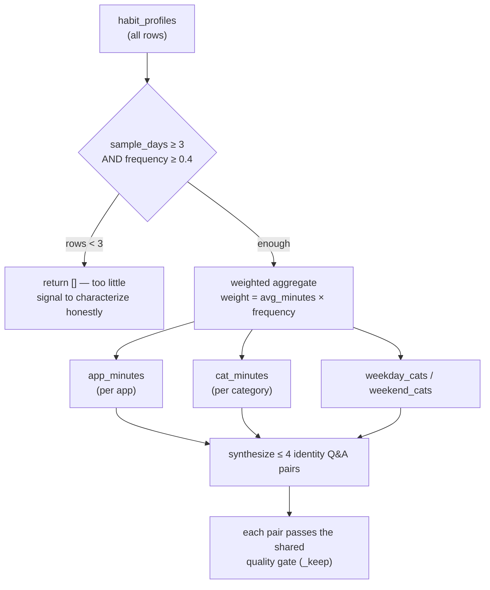

# 17 — User Profile (training source)

## Purpose

The **`profile`** training source synthesizes a small set of high-level
"who is this user" question–answer pairs from DeskMate's aggregated activity
statistics. Where the [`behavior`](16-learning-training.md) source emits one pair
per individual time-slot routine, `profile` collapses the whole behavior table
into a handful of *identity* statements (go-to apps, dominant work categories,
weekday vs weekend rhythm). The goal is to give a LoRA-fine-tuned local model a
stable sense of **who it is serving**, not just a list of isolated routines.

It is purely statistical and template-based — **no LLM generates these pairs**,
so they cannot hallucinate. It reads one table read-only and modifies nothing.

Covers `DeskMateTrainingDataMiner._from_user_profile` in
`deskmate/learning/training/data.py`. See [16 — Learning & LoRA](16-learning-training.md)
for the surrounding training subsystem.

## Key files

| File | Role |
|------|------|
| `learning/training/data.py` | `_from_user_profile()` — builds the `profile` source pairs |
| `habits/` (writes `habit_profiles`) | upstream miner that produces the aggregated routine table this source reads |
| `config.py` | `TrainingConfig.sources` — includes `"profile"` by default |
| `ui/static/app.js` | Training view: the **用户画像** source toggle + dataset preview/export |

## Input: the `habit_profiles` table

`habit_profiles` is DeskMate's "activity heatmap", mined periodically by the
habits module. One row per `(day_type, slot, category)` combination:

| Column | Meaning | Example |
|--------|---------|---------|
| `day_type` | `weekday` \| `weekend` | `weekday` |
| `slot` | 30-min slot, `0..47` (`hour*2 + (minute>=30)`) | `18` → 09:00 |
| `category` | activity class (coding/browsing/email/meeting/…) | `coding` |
| `top_app` | most-frequent app in that slot | `Code.exe` |
| `avg_minutes` | mean minutes spent per active day | `40` |
| `frequency` | `0..1` — share of days the behavior occurs | `0.8` |
| `sample_days` | distinct days backing the row (confidence) | `10` |

## How it works



Three steps:

### 1. Confidence gate

```sql
SELECT day_type, category, top_app, avg_minutes, frequency, sample_days
  FROM habit_profiles
 WHERE sample_days >= 3 AND frequency >= 0.4
```

Only rows backed by **≥ 3 distinct days** and occurring on **≥ 40 % of days**
qualify, filtering out incidental behavior. If fewer than 3 such rows exist the
source returns `[]` — it will **not** invent a persona from a day or two of
data. (This is why a freshly-installed DeskMate produces no `profile` pairs
until the habits miner has accumulated history.)

### 2. Weighted aggregation

Each qualifying row contributes a weight of `avg_minutes × frequency` (so a
behavior that is both long and frequent counts most), accumulated into four
buckets:

- `app_minutes` — total weighted time per app
- `cat_minutes` — total weighted time per category
- `weekday_cats` / `weekend_cats` — category distribution split by day type

### 3. Synthesize identity Q&A

The top-N of each bucket is rendered through fixed templates into at most four
pairs, all tagged `source="profile"`, `kind="identity"`:

| Question (input) | Answer (output) — example |
|------------------|---------------------------|
| What apps do I rely on most? | You spend most of your time in Code.exe, chrome.exe, Outlook.exe. These are your primary working tools. |
| What do I mainly work on? | Your activity is dominated by coding, email, browsing. That's where most of your time goes. |
| What are my weekdays usually like? | On weekdays you mostly focus on coding, email. |
| What do I tend to do on weekends? | On weekends your activity shifts toward browsing. |

Each candidate pair passes the same `_keep()` quality gate as every other
source (min length, output-length cap, natural-language check, input ≠ output),
and the global dedup pass collapses any whitespace/case-variant repeats.

## `profile` vs `behavior`

Both read `habit_profiles`, but serve different roles and are complementary —
both are enabled by default:

| | `behavior` | `profile` |
|--|-----------|-----------|
| Granularity | one pair **per time slot** | a few **aggregate identity** pairs |
| Count | dozens | ≤ 4 |
| Teaches the model | your routine **details** ("what at 09:00") | your **overall identity** ("who you are") |
| Gate | `sample_days ≥ 2`, `freq ≥ 0.3` | `sample_days ≥ 3`, `freq ≥ 0.4` (stricter) + needs ≥ 3 rows total |

## Interfaces & dependencies

- **Consumes**: `habit_profiles` (read-only, via the miner's own SQLite
  connection). Nothing else is touched.
- **Exposed via**:
  - CLI — `deskmate train-lora` (mines `profile` as part of the default sources;
    `--export <file.jsonl>` writes the full mined dataset for inspection).
  - API — `GET /training/data?sources=profile&full=true` previews the pairs;
    `GET /training/data/export` downloads the full JSONL.
  - UI — the **用户画像** toggle in the Training view, with per-source counts and
    the "查看完整数据集 / 下载 JSONL" controls.

## Design trade-offs

1. **Statistical, not generative** — pairs are built from real aggregates with
   fixed wording, so a fine-tuned model gains a faithful self-image with zero
   risk of fabricated persona text.
2. **Honest abstention** — the `< 3 rows` early-return means the source stays
   silent rather than over-generalizing from thin data; an empty `profile`
   count in the UI is expected for new installs, not a bug.
3. **Weight = minutes × frequency** — favors behaviors that are both sustained
   and habitual, so a rare long session doesn't masquerade as a defining trait.
4. **Few, high-signal pairs** — capping at ~4 keeps the identity signal from
   being diluted by, or diluting, the larger per-routine and Q&A sources.
5. **Separate from `behavior`** — kept as its own source (rather than folded in)
   so users can toggle "teach the model who I am" independently of "teach it my
   minute-by-minute routine".
