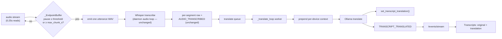

# 18 — Live Translation

## Purpose

An **opt-in, low-latency** path that translates spoken audio into a target
language and pushes it to the UI in near real time. It reuses the existing
Whisper transcription pipeline and the local Ollama LLM, adding only an
utterance-level audio chunking mode and a background translation worker.

The design resolves the usual real-time-translation tension — **low latency vs.
translation quality** — by *cutting audio at speech pauses* (so each chunk is a
complete clause, not a fixed 30s window or a single word) and feeding the
translator a **sliding window of recent context**.

Covers `[audio]` translation config, the `endpoint` chunk mode in
`audio/capture.py`, `audio/translator.py`, the `audio_transcriptions`
translation columns, the `TRANSCRIPT_TRANSLATED` event, and the Transcripts UI.

## Key files

| File | Role |
|------|------|
| `audio/capture.py` | `_EndpointBuffer` + the `chunk_mode="endpoint"` record path — slices audio per utterance |
| `audio/translator.py` | `TranscriptTranslator` — one Ollama call per utterance, with a per-device context window |
| `engine/daemon.py` | `_translate_loop` worker + queue; enqueues each transcript, back-fills the translation, emits the event |
| `db/manager.py` | `set_transcript_translation()` + the `translation` / `translation_lang` columns (with migration) |
| `events.py` | `EventType.TRANSCRIPT_TRANSLATED` |
| `engine/api.py` | surfaces `translation` on audio content items (`/audio/list` returns raw rows already) |
| `ui/static/app.js` | renders the translated line + patches it live from the SSE event |

## The latency problem and the fix

The legacy capture loop accumulates a **fixed `chunk_seconds` (30s)** buffer
before emitting — that 30s *is* the entire transcription/translation latency.
The audio itself arrives continuously (the loop reads in small increments); 30s
is just an arbitrary packaging window.

`chunk_mode="endpoint"` replaces "package by time" with "**package by speech
pause**". A speech utterance followed by a short silence is almost always a
complete clause/sentence — emitting *there* gives latency of roughly *one
sentence* (1–4s) while keeping each chunk a coherent unit, so neither
transcription nor translation loses context.



Everything downstream of the emit (transcription, Silero VAD re-segmentation,
speaker id, meeting linking, `AUDIO_TRANSCRIBED`) is **unchanged** — it simply
receives shorter, better-cut chunks.

## `_EndpointBuffer` (Phase 1)

A streaming endpointer fed one read-frame at a time via `add(frame)`. It uses a
cheap **RMS energy gate** (~−45 dBFS, the same floor as the energy-VAD fallback)
to answer one question: *is the speaker pausing right now?* That keeps the audio
thread light — the heavyweight Silero VAD still runs **downstream** on the
emitted chunk to clean/split segments.

`add()` returns the accumulated `int16` mono utterance, or `None`:

| Condition | Result |
|-----------|--------|
| heard speech, then `silence_ms` of trailing silence | **emit** the utterance |
| buffer reaches `endpoint_max_chunk_s` (long monologue) | **emit** (safety cap) |
| utterance shorter than `endpoint_min_chunk_s` | **carry forward** (no fragment emit) |
| only silence so far | keep waiting (silence is never transcribed) |

`chunk_mode="fixed"` (the default) keeps the legacy fixed-window path verbatim.

### Latency / quality presets

`translate_latency_mode` maps onto the endpoint silence threshold in
`daemon._endpoint_silence_ms`:

| Preset | silence gap | latency | quality |
|--------|-------------|---------|---------|
| `fast` | 400 ms | ~1–2s | choppier |
| `balanced` (default) | 700 ms | ~2–3s | good |
| `quality` | 1000 ms | ~3–4s | best |

## `TranscriptTranslator` (Phase 2)

One Ollama call per utterance. To preserve quality despite translating short
units, it keeps a **per-device rolling buffer** of the last
`translate_context_window` source utterances and passes them to the model as
*context only* ("do not translate this"), so pronouns and terminology stay
consistent. The buffers are keyed by device so a meeting's mic and loopback
streams don't bleed into each other; `reset_context()` is called on
`MEETING_ENDED`.

It is **fail-soft** by construction — it returns `None` (leave untranslated)
when:

- the input is empty,
- `translate_skip_if_same` and the detected language already equals the target,
- or the Ollama call fails for any reason (it never raises into the audio loop).

The LLM helpers are imported lazily inside the module to avoid a circular
import (`engine.llm` → `engine.__init__` → `daemon` → `audio`).

## Translation worker (daemon)

When `translate_enabled`, the daemon starts a `daemon-translate` thread. The
audio loop enqueues `(transcript_id, text, language, device)` after each
`AUDIO_TRANSCRIBED` (dropping silently if the bounded queue is full — translation
is best-effort). The worker translates, calls `set_transcript_translation()` to
back-fill the row, and emits `TRANSCRIPT_TRANSLATED` so the UI can patch the
matching line. Keeping it on its own thread means a slow LLM never stalls
transcription or recording.

## Storage

`audio_transcriptions` gains two nullable columns:

| Column | Meaning |
|--------|---------|
| `translation` | translated text (NULL until/unless translated) |
| `translation_lang` | target language ISO code |

`DatabaseManager._ensure_transcript_translation_columns()` `ALTER`s them onto
pre-existing databases (a fresh `CREATE TABLE IF NOT EXISTS` can't add columns
to an already-created table).

## UI

There are two surfaces:

1. **Transcripts list** — each row is tagged with `data-transcript-id`; when a
   `transcript_translated` SSE event arrives, `applyTranslationToRow()` patches
   the visible row in place (no flicker), so the translation appears as a muted,
   left-bordered line under the original.

2. **Translate view** (dedicated `Translate` nav tab) — a side-by-side
   **original / translation** stream purpose-built for watching translation
   live. `AUDIO_TRANSCRIBED` appends a row with the original text immediately and
   a "翻译中…" placeholder; `TRANSCRIPT_TRANSLATED` fills the translation side.
   New lines append at the bottom with optional auto-scroll. Its toolbar holds
   the runtime controls below.

### Runtime toggle (no restart)

The Translate toolbar exposes an **enable switch**, a **target-language** select,
and a **latency** select. Each change `POST`s to `/config/audio/translate`,
which persists the key to `config.toml` *and* (when the daemon is in-process)
calls `Daemon.set_translation()` to apply it live: it builds or drops the
`TranscriptTranslator` and ensures the translate worker thread is running. The
worker reads `self.translator` per job, so disabling simply drops queued jobs;
enabling resumes on the next utterance. No model reload, no restart.

| Route | Method | Purpose |
|-------|--------|---------|
| `/config/audio/translate` | GET | current `translate_enabled` / `target_lang` / `latency_mode` |
| `/config/audio/translate` | POST | set any of `enabled` / `target_lang` / `latency_mode`; persists + hot-applies |

## Configuration

`[audio]` (env-prefixed `DESKMATE_AUDIO__*`):

| Field | Default | Meaning |
|-------|---------|---------|
| `chunk_mode` | `fixed` | `fixed` (30s, legacy) \| `endpoint` (per-utterance, low-latency) |
| `endpoint_silence_ms` | `700` | trailing silence that ends an utterance (overridden by the latency preset) |
| `endpoint_max_chunk_s` | `8.0` | force-emit cap for an unbroken monologue |
| `endpoint_min_chunk_s` | `1.0` | minimum utterance length; shorter ones are carried forward |
| `translate_enabled` | `false` | turn live translation on |
| `translate_target_lang` | `zh` | target language ISO 639-1 code |
| `translate_skip_if_same` | `true` | skip when source already equals target |
| `translate_latency_mode` | `balanced` | `fast` \| `balanced` \| `quality` |
| `translate_context_window` | `2` | preceding utterances fed as context (0 disables) |
| `translate_model` | `""` | Ollama model; empty => the global `[ollama]` model |

Example for live meeting translation into Chinese:

```toml
[audio]
enabled = true
chunk_mode = "endpoint"
translate_enabled = true
translate_target_lang = "zh"
translate_latency_mode = "balanced"
```

## Design trade-offs

1. **Cut at pauses, not at time or words** — VAD endpointing yields complete
   clauses, simultaneously giving low latency *and* enough context for quality.
   This is the core decision that satisfies both constraints.
2. **Downstream unchanged** — endpoint mode only changes *when/where* a chunk is
   emitted; the entire transcribe/store/meeting path is reused as-is.
3. **Cheap energy gate on the audio thread, Silero downstream** — the hot path
   stays light; the accurate (heavier) VAD runs on the already-emitted clip.
4. **Sliding context window** — per-utterance translation without losing
   pronoun/terminology continuity; per-device so streams don't cross-contaminate.
5. **Async + fail-soft** — a background worker and `None`-on-failure mean a slow
   or absent Ollama degrades to "no translation", never a stall or crash.
6. **Opt-in, `fixed` by default** — existing users are unaffected; the
   low-latency path and translation are both explicit switches.

## Not in scope

- **True word-by-word streaming ASR** — would require a streaming/incremental
  Whisper; endpoint chunking already reaches 1–4s latency.
- **Two-pass "draft → refine" subtitle stabilization** — a future enhancement
  (merge adjacent sub-clauses and re-translate once a sentence completes); the
  `TRANSCRIPT_TRANSLATED` event already carries a `final` flag to support it.
- **OCR screen-text translation** — the translator is reusable, but this feature
  covers speech only.
