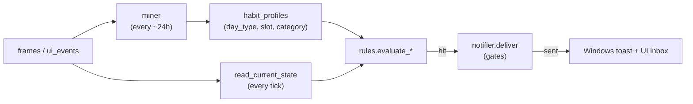

# 19 — Habits & Proactive Reminders

## Purpose

Describe how the additive `habits` module turns captured activity into
proactive, well-timed reminders ("nudges") without nagging. This is the
trigger-logic reference for the built-in coaching rules (eye-break, stand-up,
overwork, distraction, late-night/lunch) and the gates every nudge passes
through before it reaches the user.

The module is self-contained: it reads the existing `frames` / `ui_events`
tables and writes only to the `habit_*` tables. The mined routines also feed the
training pipeline — see [16 — Learning & training](16-learning-training.md) and
[17 — User profile](17-user-profile.md).

## Key files

| File | Role |
|------|------|
| `deskmate/habits/miner.py` | `frames` → `habit_profiles` (data → learned routine) |
| `deskmate/habits/rules.py` | Pure rule evaluation + `DEFAULT_RULES`; reads "current state"; bilingual message rendering |
| `deskmate/habits/notifier.py` | The single guarded exit: global switch, snooze, presence, quiet hours, cooldown, quota, feedback decay, delivery |
| `deskmate/habits/watcher.py` | Background daemon thread that ties the layers together; computes presence + language per tick |
| `deskmate/habits/presence.py` | Interruptibility probes (meeting / full-screen / Focus Assist), all fail-open |
| `deskmate/habits/store.py` | Data access for `habit_*` tables (own SQLite handle); `acknowledged_at`, per-rule `snoozed_until`, `habit_settings` kv |

`habit_suggestions` carries an `acknowledged_at` column (added by schema +
migration in `deskmate/db/manager.py`): the local-time moment the user clicked /
dismissed / rated a nudge. It drives the acknowledgement behavior below.
`habit_rules` carries a `snoozed_until` column (a temporary, auto-expiring mute,
distinct from the permanent `enabled` flag), and a small `habit_settings` kv
table holds module-wide toggles such as the global on/off switch and the
reminder language.

## Pipeline

The `watcher` ticks every `tick_interval_min` (default 5). On each tick it reads
the current state, evaluates the enabled rules in priority order, and routes the
**first deliverable** hit through the notifier.

## The two time measures (this is the crux)

A user's intuition of "I've worked all day" and the system's raw signals are
**two different things**. The module deliberately keeps two measures, because
the break rules and the overwork rule mean different things by "too long":

| Measure | Definition | Resets on a short break? | Used by |
|---------|-----------|--------------------------|---------|
| **Continuous on-screen** (`continuous_minutes`) | Longest unbroken run up to *now*, spanning app switches. A gap > 5 min (idle) resets it to 0. | **Yes** — stepping away 5 min ends the run | `eye_break`, `standup` (rest eyes / stand up) |
| **Cumulative today** (`today_category_minutes`) | Total gap-attributed minutes per category since local midnight. Short breaks do **not** reset it; idle gaps are capped so they aren't counted as work. | **No** | `overwork` (you've done too much today) |

Why this split matters — a real example from one day's data:

- Longest *continuous* run that day: **82 min**; nothing reached 120 min.
- *Cumulative* coding that day: **320 min** (≈ 5 h, broken up by coffee breaks).

With a continuous-only measure, "overwork after N hours" can fire **never** on a
normal day broken up by short breaks — the user feels overworked, the system
sees only fragments. `overwork` therefore uses the cumulative measure; the break
rules keep the continuous one (if you genuinely stepped away for 5 minutes, your
eyes and body *did* rest, so resetting is correct).

`overwork` additionally only fires while the user is **currently still** in a
work category — nagging about overwork while they're already relaxing is
pointless.

> **History — the "honest measure" fix.** An earlier single `break_reminder`
> rule was declared `rule_type:"threshold"`, which dispatches to the *cumulative*
> evaluator — so a nudge captioned "你已经连续用屏 N 分钟" was really reporting
> cumulative-today minutes, not a continuous run. It was retired (see
> `RETIRED_RULE_NAMES`, deleted on watcher startup) and split into the two
> continuous-tier rules below. When changing a rule, make sure its `rule_type`
> matches the measure its message claims.

## Three coaching tiers + smart deferral

The continuous measure now drives **two** rules at different thresholds, and a
`continuous` evaluator (`evaluate_continuous`) adds **smart deferral** so a break
nudge lands at a natural seam instead of mid-flow:

| Tier | Rule | Measure | Threshold | Idea |
|------|------|---------|-----------|------|
| Light | `eye_break` | continuous | ~35 min | 20-20-20: glance away, rest eyes |
| Bigger | `standup` | continuous | ~70 min | get up, move around |
| Cumulative | `overwork` | cumulative today | ~240 min | you've done too much today |

**Smart deferral** (continuous tier only): once past `max_minutes`, the rule does
*not* fire immediately. Inside the grace band `[max, max + defer_minutes)` it
fires only when `state.at_natural_break()` is true (a recent app switch — a seam
between tasks). Past `max + defer_minutes` it fires regardless (health wins; we
never defer forever). This keeps a break nudge from interrupting deep focus the
instant the threshold trips.

## Bilingual messages

Every rule carries a `messages: {zh, en}` dict in its `params`. `render_message`
picks the language from the `reminder_lang` setting (store-backed, see below),
falls back to `zh`, and still honours a legacy single `message` string. The
toast title also switches ("DeskMate 小助手" / "DeskMate").

## Acknowledgement: clicking a nudge acts on the timing

When the user clicks **知道了 / 有用 / 没用** on a nudge, that click is recorded
as `acknowledged_at` (via `set_suggestion_status` / `set_suggestion_feedback`)
and feeds back into *both* time measures. This answers the natural question
"after I click it, does it stop counting / re-nagging?":

| What the user did | What an acknowledgement changes | What it does **not** change |
|-------------------|---------------------------------|-----------------------------|
| Clicked a nudge | Cooldown restarts **from the click**; continuous on-screen time is **clamped to the click** | The cumulative-today total (it's a fact, not a timer — only midnight resets it) |

Concretely:

- **Cooldown anchor = later of (last sent, last acknowledged).** `notifier._in_cooldown`
  takes the max of the two timestamps. So if you actively dismiss an `overwork`
  nudge, the quiet window restarts from *your click* — a manual "I dealt with
  it, leave me alone for another `cooldown_min`" — instead of re-nagging on the
  original send schedule.
- **Continuous time is clamped by the ack.** `_continuous_screen_minutes` (and
  `read_current_state`, which also caps the per-app figure) never count
  on-screen time from *before* the user's last acknowledgement of a screen-time
  nudge (`eye_break` / `standup` / `overwork` / `lunch_break`; legacy
  `break_reminder` is still honoured for pre-split DBs). Clicking **知道了** is a
  manual "I'm taking a break", so a break nudge won't immediately refire even if
  you sat right back down and no idle gap was recorded.
- **Cumulative-today is deliberately *not* reset.** "You worked 240 min today"
  is a fact about the day; a click doesn't un-work those minutes. Re-nagging is
  prevented by the cooldown restart above, not by zeroing the count.

> Timezone note: `acknowledged_at` is stored in **local** wall-clock time
> (`store._local_now_iso`), not sqlite's UTC `datetime('now')`, so it compares
> correctly against the rules engine's local `now`. (Mixing the two would skew
> every comparison by the UTC offset and silently defeat the feature.)

## Built-in rules (`DEFAULT_RULES`)

Seeded idempotently on first run (`store.ensure_rules`); existing rows are never
overwritten, so user edits in the DB survive upgrades.

| Rule | Type | Fires when | Default cooldown |
|------|------|-----------|------------------|
| `eye_break` | continuous | Continuous on-screen ≥ 35 min (any category), at a natural break within +8 min | 30 min |
| `standup` | continuous | Continuous on-screen ≥ 70 min (any category), at a natural break within +10 min | 60 min |
| `overwork` | threshold | **Cumulative** work today ≥ 240 min (coding/meeting/writing) **and** currently still working | 90 min |
| `distraction_peak` | deviation | This slot is usually a focus slot (learned), but user has been in `browsing` ≥ 20 min | 120 min |
| `lunch_break` | schedule | 12:00–13:00, still working ≥ 40 min | 180 min |
| `late_night` | schedule | 23:00–04:00, still active (`quiet_hours` disabled so it can fire at night) | 120 min |

`continuous`-type rules take extra params: `defer_minutes` (smart-deferral grace
band) and `idle_reset_sec` (how long away counts as a break — informational; the
shared `continuous_minutes` computation uses a 5-min idle gap).

## Throttling philosophy: "if it's due and not in cooldown, let it fire"

Day-to-day pacing is owned by **each rule's own `cooldown_min`** — a semantic,
per-rule limit (e.g. a break nudge at most hourly). The gates are applied in
`notifier.deliver` **in this order** (earlier ones short-circuit):

1. **Global switch** — the `notifications_enabled` setting (the UI "提醒开关").
   Off ⇒ every nudge suppressed with reason `globally_disabled`.
2. **Feedback decay** — a rule marked "not useful" `feedback_decay_strikes`
   times in a row is auto-disabled.
3. **Per-rule snooze** — `snoozed_until` in the future (the "再等一会" / "今天别再提"
   buttons) ⇒ suppressed with reason `snoozed`. Auto-expires; distinct from the
   permanent `enabled` flag.
4. **Presence** — if the watcher passed a `busy_reason` (meeting / full-screen /
   Focus Assist), the nudge is held (reason = that signal). See Presence below.
5. **Quiet hours** — per-rule `quiet_hours` window (default `22-8`).
6. **Cooldown** — per-rule `cooldown_min` since the later of the last
   *delivered* nudge and the last *acknowledged* one (see Acknowledgement above),
   **lengthened by compliance backoff** (below).
7. **Daily quota** — a shared **runaway backstop**, *not* a daily throttle
   (default 30). It exists only to contain a misbehaving rule that hits every
   tick; a normal day stays well under it. Pacing is the cooldown's job, not the
   quota's.

**Compliance backoff** (`notifier._cooldown_minutes`): over a trailing window, if
several nudges for a rule were *sent* but *none acted on*, the effective cooldown
is lengthened (×2, then ×3) — the user clearly isn't responding to the current
pacing, so we space it out instead of nagging. Acting on one nudge relaxes it
back to the base `cooldown_min`.

### Presence (interruptibility)

`deskmate/habits/presence.py` decides whether *now* is a rude moment to nudge.
Each tick the watcher computes a `busy_reason` (when `respect_presence` is on)
from three signals, first positive wins: **meeting** (`store.has_open_meeting`,
driven by the meeting detector — see
[09 — Meeting workflow](09-meeting-workflow.md)), **Focus Assist / Do-Not-Disturb**
(registry), **full-screen foreground** (a presentation / video / game). Every
probe is **fail-open**: if it can't run (non-Windows, API missing, error) it
returns "not busy", so a detection gap never silences reminders. A held nudge is
still logged to the inbox as `suppressed` so nothing is lost.

### Tick selection: deliverable wins, not merely "hit"

At most one nudge is sent per tick. The watcher picks the first rule that is
actually **delivered**, not the first that *hits*:

- A rule can hit on *every* tick once its threshold is crossed (e.g. `standup`
  once continuous screen time passes 70 min) yet be inside its own cooldown or
  snooze. A **per-rule skip (cooldown / snooze / auto-disabled) falls through**
  to the next rule, so it does not starve a ready, lower-priority rule (e.g.
  `lunch_break`).
- A **global** gate suppresses every rule alike, so the tick stops as soon as one
  is hit. The watcher's `global_reasons` set is `globally_disabled`, `in_meeting`,
  `fullscreen`, `focus_assist`, `quiet_hours`, `daily_quota`.

> Regression history: an earlier version returned on the first *hit* regardless
> of whether it was delivered. The old `break_reminder`, which hit every tick
> after its threshold, would short-circuit the loop while in cooldown and
> silently starve every lower-priority rule — so lunch/late-night nudges
> effectively never fired. The fix is the "deliverable wins" rule above.

## Configuration

`[habits]` in `config.toml` (see `HabitsConfig` in `deskmate/config.py`):

| Key | Default | Meaning |
|-----|---------|---------|
| `enabled` | `true` | Master switch for the whole module |
| `tick_interval_min` | `5` | How often current activity is evaluated |
| `mine_interval_hours` | `24` | How often `habit_profiles` are re-mined |
| `mine_lookback_days` | `30` | Look-back window for mining routines |
| `min_frequency` | `0.5` | Share of days a (slot, category) must occur to count as a habit |
| `min_sample_days` | `3` | Minimum distinct days backing a habit |
| `quiet_hours` | `"22-8"` | Default no-notify window (rules can override) |
| `daily_quota` | `30` | Runaway backstop, not a throttle (see above) |
| `toast_enabled` | `true` | Attempt a native Windows toast; always also writes the UI inbox |
| `respect_presence` | `true` | Hold nudges during meeting / full-screen / Focus Assist (fail-open) |
| `reminder_lang` | `"zh"` | Reminder text language (`zh`/`en`); the UI toggle overrides at runtime |

Two settings are **store-backed** (in `habit_settings`, not just config.toml) so
the daemon and UI agree without a restart: `notifications_enabled` (the global
switch) and `reminder_lang` (the UI flips both via `POST /habits/settings`). The
watcher reads the store value first, falling back to the config default.

> **Toast delivery requires `winrt`.** `_try_windows_toast` imports
> `winrt.windows.ui.notifications`; if that package isn't installed in the
> *running* environment the import fails silently and delivery falls back to the
> UI inbox only (`channel="ui"` instead of `"toast"`) — no toast pops, no error.
> The two winrt sub-packages are now core dependencies in `pyproject.toml`, but a
> pre-existing env may need them installed and the daemon restarted. The
> `habit_suggestions.channel` column is the diagnostic tell.

Per-rule thresholds (`max_minutes`, `cooldown_min`, `defer_minutes`,
`categories`, …) live in the `habit_rules` table and can be tuned without code
changes. For example, to be warned about overwork after 5 cumulative hours
instead of 4, raise the `overwork` rule's `max_minutes` to `300`.

## Design trade-offs

1. **Two measures, not one** — continuous vs. cumulative are kept distinct
   because "rest your eyes" and "you've done too much today" are different
   questions; collapsing them makes one of the two rules misfire.
2. **Cooldown is the throttle; quota is a fuse** — semantic per-rule pacing is
   precise and never starves an important low-frequency nudge, whereas a global
   count is blunt and would let a high-frequency rule crowd everyone out.
3. **Idle gaps don't count as work** — the cumulative measure reuses the miner's
   gap-attributed durations (a > 5 min gap is capped), so an open-but-idle
   laptop doesn't inflate "minutes worked".
4. **Self-contained & additive** — only `habit_*` tables are written; disabling
   `habits.enabled` removes the daemon entirely with no effect on capture.
5. **A click is a signal, not a reset of facts** — acknowledging a nudge
   restarts the *timing* that governs re-nagging (cooldown, continuous run) but
   never rewrites the cumulative-today fact. This keeps "stop bothering me" and
   "how much did I actually work" cleanly separated.
6. **Three tiers by what they measure, not one knob** — eye-break and stand-up
   share the continuous measure at two thresholds; overwork uses cumulative.
   Collapsing them would make one misfire (the retired `break_reminder` did
   exactly that). The message a rule shows must match the measure it evaluates.
7. **Be honest, then be polite** — first make the measure truthful (continuous
   means continuous), then make the timing considerate (smart deferral, presence
   gating, snooze, compliance backoff). A reminder that lies about "连续 N 分钟"
   loses trust faster than one that occasionally arrives a few minutes late.
8. **Presence and toast are best-effort, never blocking** — every presence probe
   and the toast itself fail open, so a missing API or a non-Windows host
   degrades gracefully (inbox-only) rather than silencing or crashing the module.
