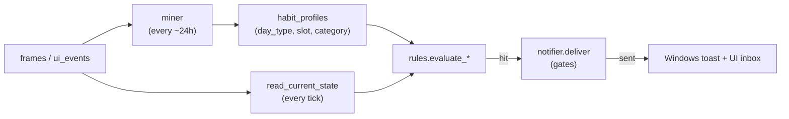

# 19 — Habits & Proactive Reminders

## Purpose

Describe how the additive `habits` module turns captured activity into
proactive, well-timed reminders ("nudges") without nagging. This is the
trigger-logic reference for the four built-in coaching rules (break, overwork,
distraction, late-night/lunch) and the gates every nudge passes through before
it reaches the user.

The module is self-contained: it reads the existing `frames` / `ui_events`
tables and writes only to the `habit_*` tables. The mined routines also feed the
training pipeline — see [16 — Learning & training](16-learning-training.md) and
[17 — User profile](17-user-profile.md).

## Key files

| File | Role |
|------|------|
| `deskmate/habits/miner.py` | `frames` → `habit_profiles` (data → learned routine) |
| `deskmate/habits/rules.py` | Pure rule evaluation + `DEFAULT_RULES`; reads "current state" |
| `deskmate/habits/notifier.py` | The single guarded exit: quiet hours, cooldown, quota, feedback decay, delivery |
| `deskmate/habits/watcher.py` | Background daemon thread that ties the layers together |
| `deskmate/habits/store.py` | Data access for `habit_*` tables (own SQLite handle) |

## Pipeline

The `watcher` ticks every `tick_interval_min` (default 5). On each tick it reads
the current state, evaluates the enabled rules in priority order, and routes the
**first deliverable** hit through the notifier.

## The two time measures (this is the crux)

A user's intuition of "I've worked all day" and the system's raw signals are
**two different things**. The module deliberately keeps two measures, because
the break rule and the overwork rule mean different things by "too long":

| Measure | Definition | Resets on a short break? | Used by |
|---------|-----------|--------------------------|---------|
| **Continuous on-screen** (`continuous_minutes`) | Longest unbroken run up to *now*, spanning app switches. A gap > 5 min (idle) resets it to 0. | **Yes** — stepping away 5 min ends the run | `break_reminder` (stand up / rest eyes) |
| **Cumulative today** (`today_category_minutes`) | Total gap-attributed minutes per category since local midnight. Short breaks do **not** reset it; idle gaps are capped so they aren't counted as work. | **No** | `overwork` (you've done too much today) |

Why this split matters — a real example from one day's data:

- Longest *continuous* run that day: **82 min**; nothing reached 120 min.
- *Cumulative* coding that day: **320 min** (≈ 5 h, broken up by coffee breaks).

With a continuous-only measure, "overwork after N hours" can fire **never** on a
normal day broken up by short breaks — the user feels overworked, the system
sees only fragments. `overwork` therefore uses the cumulative measure; `break`
keeps the continuous one (if you genuinely stepped away for 5 minutes, your eyes
and body *did* rest, so resetting is correct).

`overwork` additionally only fires while the user is **currently still** in a
work category — nagging about overwork while they're already relaxing is
pointless.

## Built-in rules (`DEFAULT_RULES`)

Seeded idempotently on first run (`store.ensure_rules`); existing rows are never
overwritten, so user edits in the DB survive upgrades.

| Rule | Type | Fires when | Default cooldown |
|------|------|-----------|------------------|
| `break_reminder` | threshold | Continuous on-screen ≥ 50 min (any category) | 60 min |
| `overwork` | threshold | **Cumulative** work today ≥ 240 min (coding/meeting/writing) **and** currently still working | 90 min |
| `distraction_peak` | deviation | This slot is usually a focus slot (learned), but user has been in `browsing` ≥ 20 min | 120 min |
| `lunch_break` | schedule | 12:00–13:00, still working ≥ 40 min | 180 min |
| `late_night` | schedule | 23:00–04:00, still active (`quiet_hours` disabled so it can fire at night) | 120 min |

## Throttling philosophy: "if it's due and not in cooldown, let it fire"

Day-to-day pacing is owned by **each rule's own `cooldown_min`** — a semantic,
per-rule limit (e.g. a break nudge at most hourly). Three further gates exist,
applied in `notifier.deliver`:

1. **Feedback decay** — a rule marked "not useful" `feedback_decay_strikes`
   times in a row is auto-disabled.
2. **Quiet hours** — per-rule `quiet_hours` window (default `22-8`).
3. **Cooldown** — per-rule `cooldown_min` since the last *delivered* nudge.
4. **Daily quota** — a shared **runaway backstop**, *not* a daily throttle
   (default 30). It exists only to contain a misbehaving rule that hits every
   tick; a normal day stays well under it. Pacing is the cooldown's job, not the
   quota's.

### Tick selection: deliverable wins, not merely "hit"

At most one nudge is sent per tick. The watcher picks the first rule that is
actually **delivered**, not the first that *hits*:

- A rule can hit on *every* tick once its threshold is crossed (e.g.
  `break_reminder` once screen time passes 50 min) yet be inside its own
  cooldown. A **per-rule cooldown skip falls through** to the next rule, so it
  does not starve a ready, lower-priority rule (e.g. `lunch_break`).
- A **global** gate (quiet hours / daily quota) suppresses every rule alike, so
  the tick stops as soon as one is hit.

> Regression history: an earlier version returned on the first *hit* regardless
> of whether it was delivered. `break_reminder`, which hits every tick after
> 50 min, would short-circuit the loop while in cooldown and silently starve
> every lower-priority rule — so lunch/late-night nudges effectively never
> fired. The fix is the "deliverable wins" rule above.

## Configuration

`[habits]` in `config.toml` (see `HabitsConfig` in `deskmate/config.py`):

| Key | Default | Meaning |
|-----|---------|---------|
| `enabled` | `true` | Master switch for the whole module |
| `tick_interval_min` | `5` | How often current activity is evaluated |
| `mine_interval_hours` | `24` | How often `habit_profiles` are re-mined |
| `mine_lookback_days` | `30` | Look-back window for mining routines |
| `min_frequency` | `0.5` | Share of days a (slot, category) must occur to count as a habit |
| `min_sample_days` | `3` | Minimum distinct days backing a habit |
| `quiet_hours` | `"22-8"` | Default no-notify window (rules can override) |
| `daily_quota` | `30` | Runaway backstop, not a throttle (see above) |
| `toast_enabled` | `true` | Attempt a native Windows toast; always also writes the UI inbox |

Per-rule thresholds (`max_minutes`, `cooldown_min`, `categories`, …) live in the
`habit_rules` table and can be tuned without code changes. For example, to be
warned about overwork after 5 cumulative hours instead of 4, raise the
`overwork` rule's `max_minutes` to `300`.

## Design trade-offs

1. **Two measures, not one** — continuous vs. cumulative are kept distinct
   because "rest your eyes" and "you've done too much today" are different
   questions; collapsing them makes one of the two rules misfire.
2. **Cooldown is the throttle; quota is a fuse** — semantic per-rule pacing is
   precise and never starves an important low-frequency nudge, whereas a global
   count is blunt and would let a high-frequency rule crowd everyone out.
3. **Idle gaps don't count as work** — the cumulative measure reuses the miner's
   gap-attributed durations (a > 5 min gap is capped), so an open-but-idle
   laptop doesn't inflate "minutes worked".
4. **Self-contained & additive** — only `habit_*` tables are written; disabling
   `habits.enabled` removes the daemon entirely with no effect on capture.
