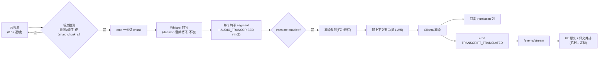

# 实时翻译功能 — 实现规划(v2:低延迟 + 保质量)

## 目标

把 deskmate 转写的语音/会议内容,实时用本地 Ollama (qwen) 翻译成目标语言,
在 deskmate UI 里原文 + 译文并排显示。

**硬约束(用户)**:
1. **不能接受 30s 延迟**
2. **不能逐字/逐词翻译** —— 会丢上下文,译文质量差、来回抖动

## 决策(已确认)

- **翻译对象**:语音/会议转写(复用现有 Whisper 管道)
- **翻译引擎**:本地 Ollama (qwen)
- **呈现**:deskmate UI 内(复用现有 SSE 实时推送)

## 核心洞察:延迟的真正来源

调研代码后,30s 延迟**只来自一个地方**:

```python
# capture.py — 音频其实是连续到达的(每 0.5s 读一次),
# 但要"攒够 30s"才打包成一个 chunk 发出去
data, _ = stream.read(int(self.sample_rate * 0.5))   # ← 连续到达
buffer.append(data.copy())
if total >= chunk_samples:                            # ← 30s 才发
    self._emit(label, arr)
```

而下游**已经具备低延迟所需的一切**:
- **Silero VAD** ([vad.py](../deskmate/audio/vad.py))已经能按"语音段 + 停顿"切分;
- Whisper 已经返回**句子级** segment(带 start/end 时间)。

**结论**:30s 是一个**人为的打包窗口**,不是技术限制。把"按固定时间打包"
换成"**按说话停顿打包**",延迟就从 30s 降到"一句话的长度"(1–4s),而且因为
切在自然停顿处,**每个 chunk 都是完整子句**,转写和翻译的上下文都完整 —— 这正好
同时满足两条硬约束。

> 这也是业界实时字幕(同传、YouTube 实时字幕)的标准做法:**按语义单元切,
> 不按固定时间切**;再配合上下文窗口和稳定化,兼顾延迟与质量。

## 方案:端点检测(endpointing)驱动的流式分块 + 带上下文翻译

### 三个支柱

#### 支柱 1 —— 端点检测分块(把 30s 换成"说完一句就发")

新增一个低延迟采集路径 `chunk_mode = "endpoint"`(默认仍是 `"fixed"`,opt-in)。
录音循环维持现在的 0.5s 读帧,但**发块条件**改为:

- 维护一个滚动 buffer;每收到一帧,在 buffer 尾部用 VAD 判断是否处于**静音**;
- 当检测到 **一段语音 + 一个 ≥ `endpoint_silence_ms` 的停顿**(即一句话说完了)
  → **立刻 `_emit` 这一段**;
- 安全上限 `max_chunk_s`(如 8s):有人一口气说很久不停顿时,到上限也强制发块,
  避免无限等待;
- 下限 `min_chunk_s`(如 1s):太短的碎片("嗯"、"对")并入下一段,避免无意义翻译。

这样**单块时长 = 一句话**,延迟 ≈ `句长 + 转写 + 翻译` ≈ **1–4s**。

```
连续音频(0.5s 逐帧读,已有)
   │  每帧追加到滚动 buffer
   ▼
尾部 VAD 端点检测
   │  语音段 + 停顿 ≥ endpoint_silence_ms ?  或 buffer ≥ max_chunk_s ?
   ▼ 是
_emit(这一句)  ──► 现有 daemon 音频循环(零改动:它只是更频繁地拿到更短的块)
```

**关键**:daemon 的转写循环、VAD 二次分段、写库、`AUDIO_TRANSCRIBED` 全部**不用改**
—— 它们本来就是"拿到一个 WAV → 转写 → 逐 segment 处理"。我们只是让 chunk 更短、
切在更好的位置。

#### 支柱 2 —— 带滑动上下文窗口的翻译(保质量)

逐句翻译最大的风险是丢上下文(代词、专有名词、上下句呼应)。解决办法:翻译当前句时,
把**前 1–2 句原文**作为上下文喂给 qwen,但 prompt 明确"上文仅供理解,只翻译当前句":

```
你是专业同传。下面是最近的对话上文(仅供你理解语境,不要翻译它):
<前 1-2 句原文>
请把下面这一句翻译成<目标语言>,只输出译文,不要解释、不要加引号:
<当前句>
```

- 上下文窗口在 `translator.py` 内用一个**按 device/meeting 维度的环形缓冲**维护;
- 这样切碎了也不丢语境,术语/代词翻译保持连贯。

#### 支柱 3 —— 两段式"快译 → 定稿"(可选增强,稳定化)

借鉴 YouTube 实时字幕的稳定化策略,消除"译文抖动":

- **快译**:每个端点块一到,立刻翻译并推送,UI 上以**浅灰/斜体**标记"临时";
- **定稿**:若紧接着的停顿很短(说明是同一句话被切开的子句),等下一块到达后,
  把相邻子句**合并重译一次**,推 `TRANSCRIPT_TRANSLATED`(final=true),UI 替换临时译文为定稿(正常颜色)。

> Phase 1 可先只做"快译"(单段式),把支柱 3 放到 Phase 3 作为质量增强 —— 这样
> 第一版就能用,且风险可控。

### 延迟 / 质量,可调档

一个配置项把"切多碎"交给用户:

| `translate_latency_mode` | `endpoint_silence_ms` | 行为 | 延迟 | 质量 |
|---|---|---|---|---|
| `fast` | 400 | 停顿一点就切 | 最低(~1–2s) | 片段略碎 |
| `balanced`(默认) | 700 | 等一个自然子句 | ~2–3s | 好 |
| `quality` | 1000 | 等较完整的句子 | ~3–4s | 最佳 |

## 架构



## 分阶段实现

### Phase 1 — 端点检测采集(低延迟的根)

1. **配置** [config.py `AudioConfig`]
   ```toml
   [audio]
   chunk_mode = "fixed"               # "fixed"(默认,现状) | "endpoint"(低延迟)
   endpoint_silence_ms = 700          # 停顿多久算"说完一句"
   endpoint_max_chunk_s = 8           # 一口气说太久的兜底上限
   endpoint_min_chunk_s = 1           # 太短并入下一段
   ```

2. **采集** [capture.py]
   - `AudioRecorder` 支持 `chunk_mode`;新增 `_endpoint_emit_loop`(或在 `_record_loop`
     里分支):用一个轻量 VAD 端点检测器判断发块时机;
   - VAD 复用 `SileroVAD`,但这里只需要"尾部是否进入静音"的增量判断
     (在滚动 buffer 上跑,~0.5s 一次,开销可忽略);
   - `_emit` / queue / WAV 写盘逻辑**完全复用**,只是触发时机变了。

3. **验证**:开 `endpoint` 模式说几句话,确认每句话停顿后 1–4s 内就出现转写。

### Phase 2 — 翻译管道 + UI(核心)

4. **配置** 续:
   ```toml
   translate_enabled = false          # 默认关
   translate_target_lang = "zh"
   translate_latency_mode = "balanced"
   translate_skip_if_same = true      # 原文已是目标语言则跳过
   ```

5. **翻译器** 新增 `deskmate/audio/translator.py`
   - `TranscriptTranslator(target_lang, model)`:封装 Ollama 调用 + 上下文窗口;
   - 维护 per-device 的环形上下文缓冲(前 1–2 句原文);
   - prompt 严格约束只输出译文;空输入/同语言直接返回原文;
   - 失败降级:Ollama 不可用 → 返回 None,不影响转写;
   - 单例/懒加载,复用 ask.py 的 Ollama 设置。

6. **DB** [schema.py + manager.py]
   - `audio_transcriptions` 加列 `translation TEXT`、`translation_lang TEXT`;
   - `set_transcript_translation(transcript_id, translation, lang)`。

7. **接线** [daemon.py 音频循环,emit `AUDIO_TRANSCRIBED` 之后]
   - 若 `translate_enabled`:把 `(tid, text, seg.language, device)` 丢进**后台翻译队列/线程**;
   - 翻译完成 → `set_transcript_translation` 回填 → emit `TRANSCRIPT_TRANSLATED`
     (`transcript_id` + `translation` + `final`);
   - 独立线程/队列,翻译慢不拖累转写循环。

8. **事件** [events.py]:新增 `EventType.TRANSCRIPT_TRANSLATED`。

9. **API** [api.py]:`recent_transcripts` / `/audio/list` 返回带 `translation` 字段
   (SSE 无需改 —— 新事件自动透传)。

10. **前端** [app.js + index.html + app.css]
    - Transcripts 页:每条转写下方显示译文;
    - 监听 SSE `TRANSCRIPT_TRANSLATED` → 找到对应行填译文(实时,无需刷新);
    - 会议页转写同理;一个开关/目标语言选择(可选,先用 config)。

### Phase 3 — 稳定化 + 测试 + 文档

11. **两段式"快译→定稿"**(支柱 3):相邻子句合并重译,UI 临时→定稿替换。
12. **测试**:端点检测分块边界;translator 的 prompt/上下文窗口/同语言跳过/失败降级;
    DB 回填;事件 emit/订阅。
13. **文档**:新增 `docs/18-live-translation.md`,README 提一句。

## 设计取舍

1. **按停顿切,不按时间切** —— 用 VAD 端点检测替代固定 30s,这是同时满足
   "低延迟"和"不逐字、保上下文"两条硬约束的关键。每块都是完整子句。
2. **下游零改动** —— daemon 转写循环只是拿到更短、切得更好的块,所有现有逻辑
   (VAD 二次分段、写库、speaker、meeting link、`AUDIO_TRANSCRIBED`)原样复用。
3. **滑动上下文窗口** —— 逐句翻译但带前文,代词/术语连贯,质量不因切碎而降。
4. **延迟可调档** —— `fast/balanced/quality` 让用户按场景权衡。
5. **异步翻译 + 失败降级** —— 后台线程;Ollama 挂了只是没译文,转写照常。
6. **默认关闭、默认 fixed 模式** —— opt-in,不影响现有用户;低延迟路径单独开关。
7. **复用 SSE** —— 实时推送零新管道。
8. **两段式稳定化留到 Phase 3** —— 第一版单段"快译"即可用,稳定化作为增强,
   降低首版风险。

## 不在本期范围(诚实说明)

- **真·逐字流式 ASR**:需把 Whisper 换成流式/增量解码模型(如 streaming
  whisper),工程量大;端点检测分块已能把延迟压到 1–4s,够用。
- **桌面悬浮字幕窗**:独立 overlay 窗口,另一套 UI 技术栈。
- **OCR 屏幕文字翻译**:本期只做语音;translator 可复用,后续易加。

## 工作量预估

Phase 1(端点采集)约 25%;Phase 2(翻译 + UI)约 55%;Phase 3(稳定化 + 测试文档)约 20%。
我会分阶段提交并每步验证。
