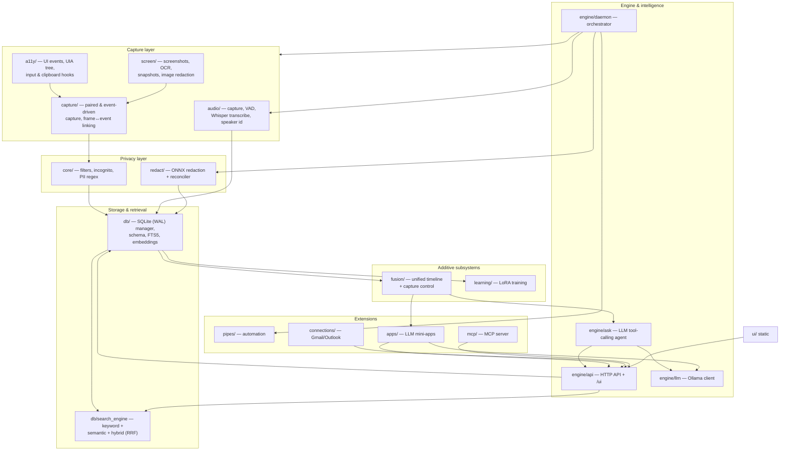

# DeskMate Technical Design Docs

DeskMate is a local-first desktop activity recorder for Windows. It continuously
captures what happens on screen (screenshots + OCR), the accessibility tree, user
input, and audio, stores everything in a local SQLite database, and exposes it
through search, an HTTP API, an LLM "Ask" agent, and automation pipes — all on
the user's machine with no cloud dependency.

These docs explain the **technical design and framework of each module** at a
moderate level of detail. They are organized by layer, following the data flow
from capture to intelligence.

## Top-level architecture

The arrows show the dominant data flow: **capture → privacy filtering → storage →
retrieval → intelligence**, with the `daemon` orchestrating background threads and
the HTTP `api` acting as the single integration surface that `ask`, `apps`, `mcp`,
and the web `ui` all talk to.

## Document index

| # | Doc | Covers |
|---|-----|--------|
| 01 | [Architecture & runtime](01-architecture.md) | Process model, daemon orchestration, config, paths, logging, events |
| 02 | [Capture](02-capture.md) | `capture/` + `screen/` — paired capture, event-driven loop, OCR, snapshots |
| 03 | [Accessibility & input](03-accessibility.md) | `a11y/` — UIA tree, WinEvent hooks, input/clipboard, browser URL |
| 04 | [Audio](04-audio.md) | `audio/` — capture, VAD, Whisper transcription, speaker identification |
| 05 | [Storage](05-storage.md) | `db/` — SQLite manager, schema, FTS5 tables, text normalization |
| 06 | [Search](06-search.md) | Keyword (FTS5/BM25) + semantic (embeddings) + hybrid (RRF) retrieval |
| 07 | [Privacy & redaction](07-privacy-redaction.md) | `core/` + `redact/` — filters, incognito, PII regex + ONNX |
| 08 | [Engine & intelligence](08-engine-intelligence.md) | `engine/` — daemon, API, CLI, LLM client, Ask agent, summaries |
| 09 | [Meeting & workflow](09-meeting-workflow.md) | `meeting/` detection + `workflow/` classification |
| 10 | [Pipes](10-pipes.md) | `pipes/` — markdown automation: loader, runtime, scheduler |
| 11 | [Connections](11-connections.md) | `connections/` — Gmail / Outlook OAuth + email parsing |
| 12 | [MCP server](12-mcp.md) | `mcp/` — Model Context Protocol stdio server |
| 13 | [Apps](13-apps.md) | `apps/` — LLM mini-apps, `agent.py`, `common.py`, `pipe.md`, SKILL |
| 14 | [Web UI](14-ui.md) | `ui/` — static front-end served at `/ui` |
| 15 | [Fusion & timeline](15-fusion-timeline.md) | `fusion/` — unified `context_events` timeline + capture control (pause/forget/per-source) |
| 16 | [Learning & LoRA](16-learning-training.md) | `learning/` — opt-in LoRA training from local data |
| 17 | [User profile](17-user-profile.md) | `profile` training source — synthesized "who is this user" identity pairs |
| 18 | [Live translation](18-live-translation.md) | Low-latency speech translation — endpoint chunking + per-utterance Ollama translation |
| 19 | [Habits & reminders](19-habits-reminders.md) | `habits/` — routine mining + proactive nudges (three-tier reminders, presence, bilingual) |
| 20 | [Model Service](20-model-service.md) | `modelsvc/` — download / pull / run the local Ollama service from the UI |

## Conventions used in these docs

Each module doc follows the same skeleton:

1. **Purpose** — one sentence.
2. **Key files** — file → role table.
3. **Design & data flow** — how it works, with a diagram where useful.
4. **Interfaces & dependencies** — what it consumes/exposes and to whom.
5. **Design trade-offs** — the notable decisions and why.
